# GRE Prep — Local-First Desktop App

A best-in-class offline GRE preparation platform: section-adaptive mock tests, a 9,600-word spaced-repetition vocab deck, per-subtopic mastery analytics, and an optional LLM tutor that never controls your score. Every millisecond of timing, every answer key, every adaptive routing decision is deterministic and runs locally on your machine. The LLM layer is opt-in — drills, mocks, vocab, and analytics all work with no API key.


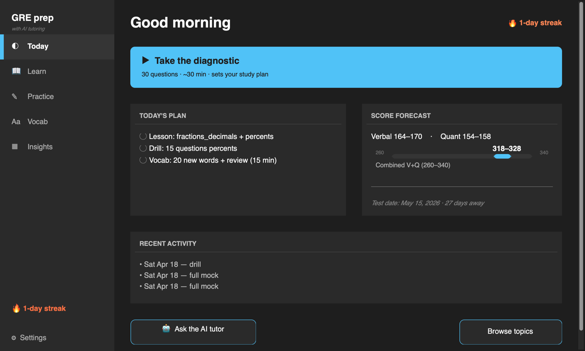

---

## Quick start

```bash
git clone https://github.com/badalpardhi12/gre_with_ai.git
cd gre_with_ai
chmod +x setup.sh && ./setup.sh        # builds venv, runs migrations, optional API-key prompt
venv/bin/python main.py                # launches the app
```

`setup.sh` is idempotent. Re-run it after every `git pull`. An OpenRouter key is optional — skip the prompt and the app still runs every offline feature.

---

## Screenshots

| Today — home | Practice — mode picker | Error Log |
|---|---|---|
|  | 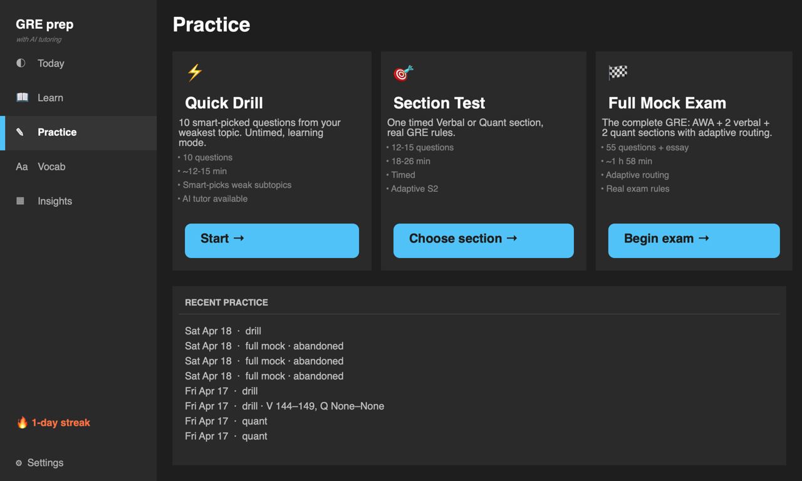 | 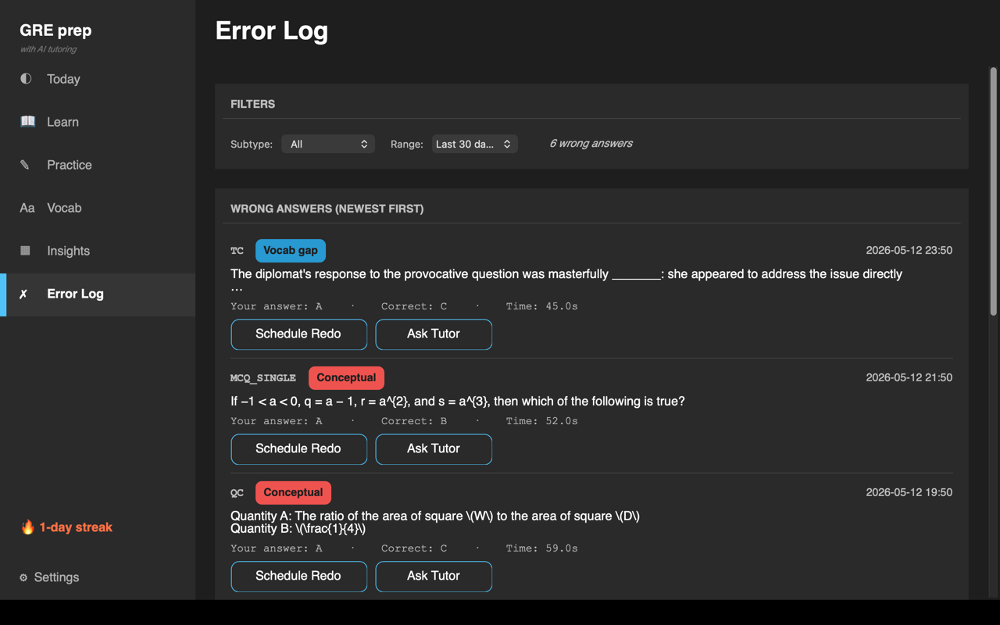 |

| Practice question (mid-session) | Learn — mastery heatmap | Insights — forecast + plan + history |
|---|---|---|
| 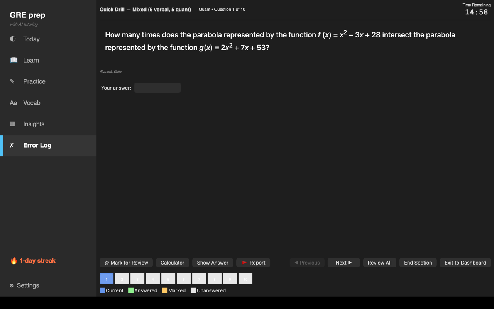 | 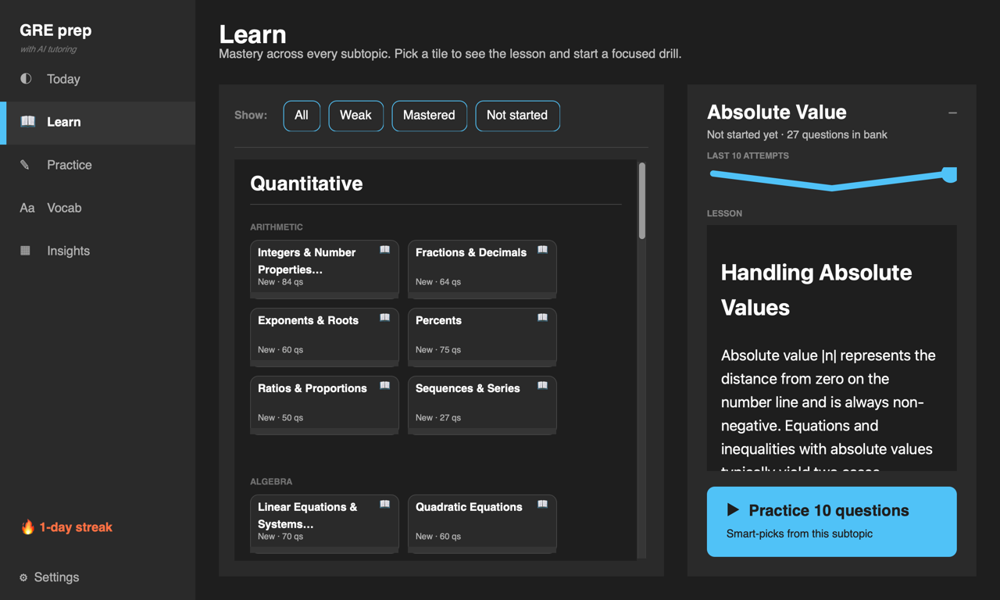 | 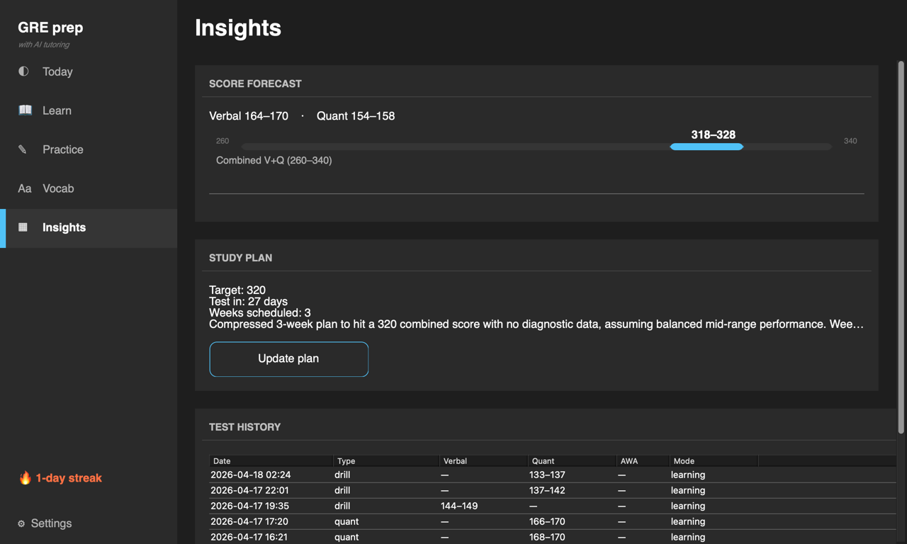 |

| Results | Vocab (FSRS) | Onboarding wizard |
|---|---|---|
| 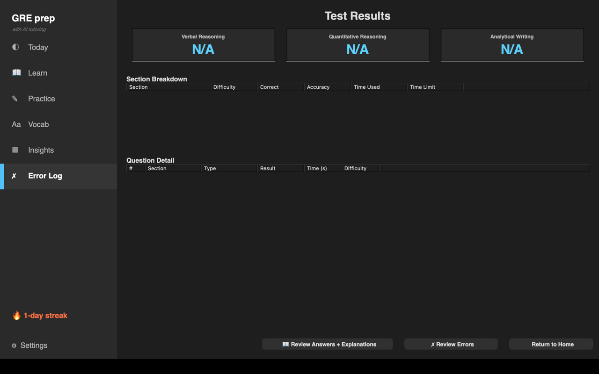 | 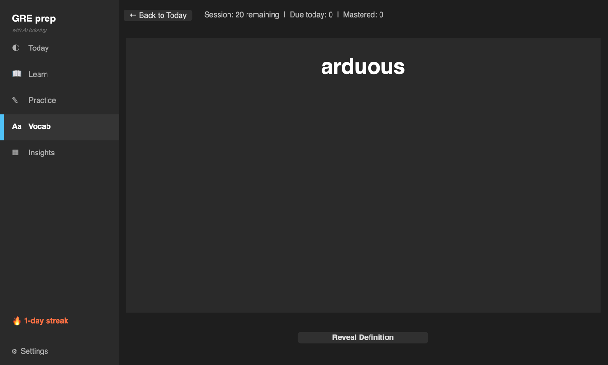 | 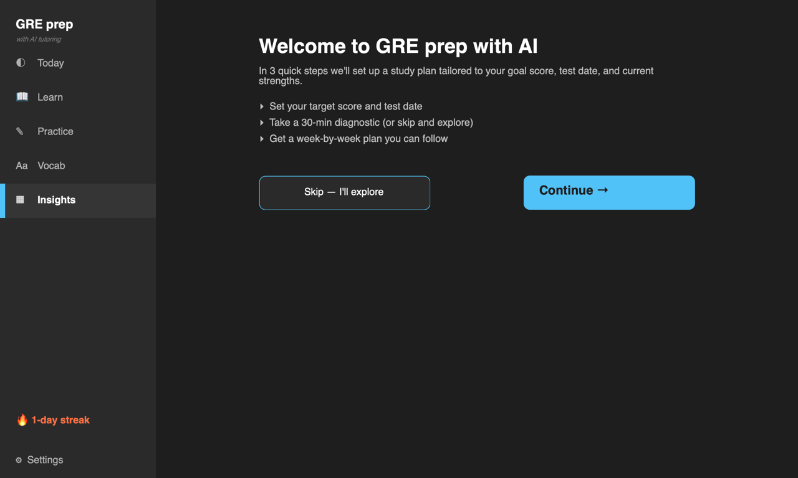 |

---

## Architecture (presentation-grade)

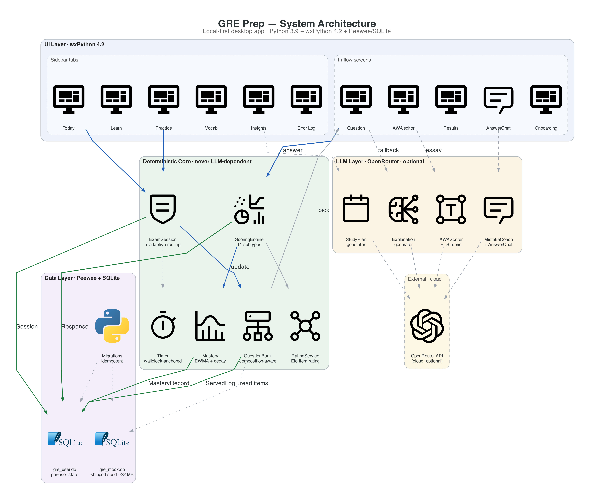

Source: [`docs/architecture/gre_architecture.py`](docs/architecture/gre_architecture.py) · PDF: [`docs/architecture/gre_architecture.pdf`](docs/architecture/gre_architecture.pdf)

### Three-layer separation

1. **Deterministic core** (`services/scoring.py`, `models/exam_session.py`, `widgets/timer.py`) — section engine, timer, answer checking, adaptive routing. Never depends on the LLM; your score is always computed from the answer key.
2. **LLM layer** (`services/llm_service.py` + friends) — AWA scoring, per-question tutor, mistake coach, study plans, explanation fallback. Gated by an OpenRouter API key; every UI surface that consumes it degrades gracefully when the key is absent.
3. **Data layer** — SQLite + Peewee, ~25 tables, on-launch idempotent migrator. The shipped seed `data/gre_mock.db` is a tracked ~22 MB blob; per-user state lives in the gitignored `data/gre_user.db` bootstrapped from the seed on first launch.

### Session flow (Mermaid)

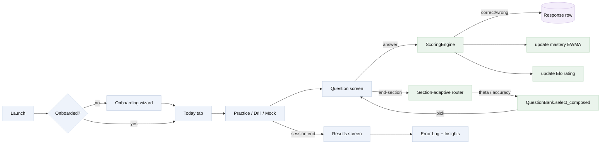

---

## Data model (Mermaid ER)

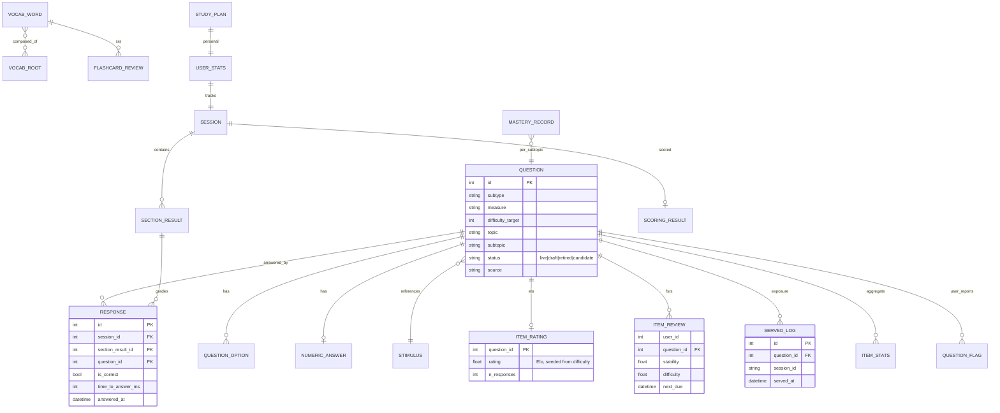

---

## Content pipeline (Mermaid sequence)

Every item in the shipped `data/gre_mock.db` came through the same five-stage extraction / generation pipeline. Each D-task has its own source-tag (`source=` column) so provenance is auditable downstream.

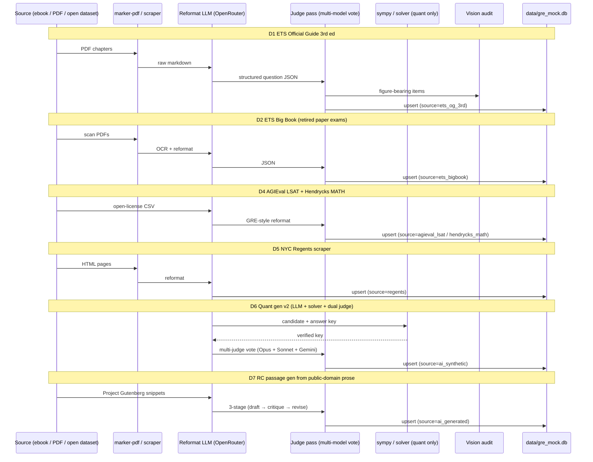

---

## Features

| Area | What it does | Source |
|---|---|---|
| **Full mock tests** | Post-Sep-2023 format: AWA + V1·12 + V2·15 + Q1·12 + Q2·15, 1h58m total, section-adaptive between V1→V2 and Q1→Q2 | [`models/exam_session.py`](models/exam_session.py) |
| **All 11 question subtypes** | TC (1/2/3-blank), SE, RC single/multi/select-in-passage, QC, MCQ single/multi, Numeric Entry, Data Interpretation | [`services/scoring.py`](services/scoring.py) |
| **Smart drill picker** | 60% never-seen + 30% wrong-before + 10% right-before, skipping items served in the last 14 days | [`services/question_bank.py`](services/question_bank.py) |
| **Per-subtopic mastery** | EWMA over recent attempts, weighted by difficulty, with forgetting-curve decay; mastered at ≥0.80 over 10 attempts | [`services/mastery.py`](services/mastery.py) |
| **Elo item rating** | Per-item Elo seeded from difficulty label, updated on every response; powers information-theoretic question selection | [`services/rating_service.py`](services/rating_service.py) |
| **Randomesque selection** | Top-5-by-info + shuffle-within-top-5, smooths item exposure over long study horizons | [`services/question_bank.py`](services/question_bank.py) |
| **FSRS item scheduler** | Wrong items can be scheduled for spaced review; reused from the vocab FSRS engine | [`services/srs.py`](services/srs.py) |
| **Cross-session dedup** | Questions served in the current mock are excluded from the next one via `ServedLog` (independent of Response commits) | [`services/question_bank.py`](services/question_bank.py) |
| **Cluster cooldown** | 7-day cooldown on RC passage + DI cluster stimulus IDs, so the same passage can't reappear within a week | [`services/question_bank.py`](services/question_bank.py) |
| **Score forecast** | Logistic Verbal/Quant scaled-score range + 10-session sparkline | [`services/score_forecast.py`](services/score_forecast.py) |
| **Diagnostic (30Q)** | Stratified intake produces per-topic accuracy, weakness ranking, predicted scaled-score band | [`services/diagnostic.py`](services/diagnostic.py) |
| **Error log as UX** | Wrong answers classified (careless / conceptual / timing / vocab-gap), filtered, and actionable (Schedule Redo · Ask Tutor) | [`screens/error_log_screen.py`](screens/error_log_screen.py) |
| **AWA scoring (LLM)** | ETS-rubric-aligned, 4 subscores (analysis / structure / support / conventions) with prompt-injection hardening | [`services/awa_scorer.py`](services/awa_scorer.py) |
| **AnswerChat (LLM)** | Per-question tutor, scope-locked, never overrides the answer key | [`services/mistake_coach.py`](services/mistake_coach.py) |
| **Mistake-pattern coach** | Every 50 lifetime mistakes, Opus analyzes the error log → 3-bullet diagnosis + targeted drill | [`services/mistake_coach.py`](services/mistake_coach.py) |
| **Study plan generator** | Personalized week-by-week plan from diagnostic + mastery + bank availability | [`services/study_plan.py`](services/study_plan.py) |
| **Vocab (9,647 words)** | FSRS flashcards with definition, examples, synonyms/antonyms, root analysis, mnemonic | [`services/srs.py`](services/srs.py) |
| **Contextual vocab** | Generated 120-word passages + inference question per target word | [`services/vocab_context_gen.py`](services/vocab_context_gen.py) |
| **Streak + onboarding** | Daily streak with freeze-day forgiveness; 3-step first-launch wizard | [`services/streak.py`](services/streak.py) |
| **Crash recovery** | Every answer `fsync`'d to a journal; killed-mid-test state recoverable on next launch | [`models/exam_session.py`](models/exam_session.py) |
| **DI charts** | Real matplotlib-rendered charts (pie, bar, line, scatter, table), base64-embedded — no `file://` exposure | [`widgets/math_view.py`](widgets/math_view.py) |

---

## Tech stack

| Layer | Choice | Rationale |
|---|---|---|
| Language | Python 3.9.6 | Wheel availability for wxPython on macOS; 3.13 is blocked by a numpy/clang mismatch |
| GUI | wxPython 4.2.4 | Native widgets on macOS / Linux / Windows; `html2.WebView` for KaTeX-rendered stems |
| ORM | Peewee | ~22 tables, migrations runnable at launch, lighter than SQLAlchemy for an embedded DB |
| Database | SQLite | Zero-config, single-file, crash-safe with WAL, shippable as a seed blob |
| Math rendering | KaTeX | Bundled under `resources/katex/`; sanitized via `bleach` + strict CSP |
| Charts | matplotlib (dark theme) | Rendered once, embedded as base64 PNG into stimulus HTML |
| LLM layer | OpenRouter | One API surface for Opus / Sonnet / Gemini; easy to swap judges |
| Testing | pytest | 533 tests across 40+ modules; `tmp_db` fixture swaps to a throwaway DB |

---

## Dataset growth scripts

Each of these builds items tagged with a unique `source=` and writes `provenance_json` for audit:

| Script | What it does |
|---|---|
| [`scripts/extract_ets_og.py`](scripts/extract_ets_og.py) | ETS Official Guide 3rd ed. → marker-pdf → LLM reformat → upsert |
| [`scripts/extract_ets_bigbook.py`](scripts/extract_ets_bigbook.py) | ETS Big Book retired-paper exams → OCR → reformat → subtype-filter |
| [`scripts/extract_ets_bigbook_stub.py`](scripts/extract_ets_bigbook_stub.py) | Stub harness for iterating on the Big Book pipeline without the full PDF |
| [`scripts/extract_agieval_math.py`](scripts/extract_agieval_math.py) | AGIEval LSAT-LR/RC + Hendrycks MATH → GRE-style reformat |
| [`scripts/extract_regents.py`](scripts/extract_regents.py) | NYC Regents math exams → quant-reformat with solver verification |
| [`scripts/generate_quant_items.py`](scripts/generate_quant_items.py) | Quant gen v2 — LLM + sympy solver verification + dual-judge vote |
| [`scripts/generate_rc_passages.py`](scripts/generate_rc_passages.py) | RC passage gen from public-domain prose (3-stage draft→critique→revise) |
| [`scripts/recalibrate_irt.py`](scripts/recalibrate_irt.py) | Offline 2PL IRT recalibration with `girth`, priors from Elo rating |
| [`scripts/audit_data_corruption.py`](scripts/audit_data_corruption.py) | Heuristic scan for wrong-explanation / bad-figure rows |

---

## Development

```bash
# Activate the env
source venv/bin/activate

# Run the app
python main.py

# Run the test suite (533 tests, < 60s on an M-series Mac)
venv/bin/python -m pytest tests/ -q

# Run only the repetition-floor benchmark (20-mock simulation)
venv/bin/python -m pytest tests/benchmarks/test_repetition_floor.py -v

# Recalibrate IRT offline (optional, requires response data)
venv/bin/python scripts/recalibrate_irt.py
```

### Adding a feature

1. **Write the test first** under `tests/test_<feature>.py` using the `temp_db` fixture (see `tests/conftest.py`).
2. **Put deterministic logic in `services/`** — never inside a screen. Screens are presentation only.
3. **LLM calls go through `services/llm_service.py`** (never call `httpx` directly). The service wraps callbacks in `wx.CallAfter` and handles timeouts.
4. **Schema changes require a migration**. Add the file under `models/migrations.py`, give it a numeric prefix + date, and make it idempotent (every migration runs at every launch).
5. **UI tokens come from `widgets/theme.py` + `widgets/ui_scale.py`** — no hardcoded `wx.Colour` or font sizes in `screens/`.

---

## Bug reports

Every question screen has a flag icon that opens a pre-filled GitHub issue with qid + source + full JSON + a PNG of the main window. See [`docs/reporting.md`](docs/reporting.md) for the full flow, the screenshot-capture fallback ladder, and what the developer sees on the other end.

---

## Data Interpretation charts

DI questions render real visualisations (not inline text):

- **Rendered charts** (pie, bar, grouped-bar, line, stacked-bar, scatter) ship as base64-encoded PNGs inlined into the stimulus HTML. The `html2.WebView` renders them without `file://` access, eliminating path-traversal surface.
- **Tables** render as styled HTML; markdown pipe-tables in source content are converted to HTML at render time by `widgets/math_view._markdown_tables_to_html`.
- **LaTeX inline math in options** is normalised to readable Unicode (options render as `wx.StaticText`, no KaTeX WebView needed).

A figure audit over the quant corpus is documented in [`docs/figure_audit_2026_05_11.md`](docs/figure_audit_2026_05_11.md) — 1 mismatch out of 36 image-bearing items, already retired.

---

## Roadmap

The full 90-day plan lives in [`docs/implementation_plan_2026_05_12.md`](docs/implementation_plan_2026_05_12.md):

| Phase | Window | Deliverables |
|---|---|---|
| Phase 0 | Week 0 | Repetition-floor benchmark (P0.1) — done |
| Phase 1 | Week 1 | R1–R5 quick wins: DI gate, figure floor, served-log, consecutive-mock exclude, widening fallback — done |
| Phase 2 | Weeks 2–3 | Error-log-as-UX, FSRS items, Elo, randomesque, timing analytics (E1–E5) — done |
| Phase 3 | Weeks 4–8 | Section-level CAT wire-up, contextual vocab, calibrated AWA, forgetting curve (S1–S4) — done |
| Phase 4 | Weeks 9–12 | Offline IRT recalibration, score-forecast calibration, cluster cooldown, dataset Tier 1 (D1–D7) — done |

Diagnosis of the original "repetitiveness" complaint that drove the plan: [`research/gre-repetitiveness-roadmap/report.md`](research/gre-repetitiveness-roadmap/report.md).

---

## Configuration

### Runtime LLM (OpenRouter)

Configure via the in-app **Settings** dialog (atomically saved to `data/llm_config.json`, `chmod 0o600`) or environment variables:

| Variable | Default | Purpose |
|---|---|---|
| `OPENROUTER_API_KEY` | — | Your OpenRouter key |
| `OPENROUTER_BASE_URL` | `https://openrouter.ai/api/v1` | API base URL |
| `LLM_MODEL` | `anthropic/claude-opus-4` | Model id |
| `LLM_MAX_TOKENS` | `4096` | Response cap |

### LLM call hardening

- **Timeout**: connect 10 s, read 180 s, write 10 s, pool 10 s. Long generations (study plans can take 90 s) succeed; stuck connections surface as a friendly error rather than a hung UI.
- **Threading**: `call_async` / `chat_async` wrap callbacks in `wx.CallAfter` so GUI updates happen on the main thread.
- **Prompt-injection hardening**: AnswerChat and explanation prompts wrap user-untrusted blocks (`<stimulus>`, `<prompt>`, `<options>`, `<student_answer>`, `<explanation>`) and the system prompt explicitly warns the model not to follow embedded instructions.
- **WebView sanitization**: `widgets/html_sanitizer.py` runs every LLM-generated stimulus/prompt/explanation through `bleach` before `wx.html2.WebView.SetPage`. The page also has a strict CSP (`default-src 'self' data:`, `connect-src 'none'`).

---

## Troubleshooting

**wxPython on Linux** → `sudo apt install libgtk-3-dev libwebkit2gtk-4.0-dev` before `pip install wxPython`.

**numpy / wxPython "metadata-generation-failed" on macOS Python 3.13** → pin to Python 3.12 (`brew install python@3.12 && PYTHON=python3.12 ./setup.sh`).

**Empty dashboard / "no questions"** → the seed DB didn't land during clone. `git checkout HEAD -- data/gre_mock.db`.

**AWA score shows N/A / AI tutor doesn't open** → configure your OpenRouter key via Settings. The Insights tab disables the "Run coach now" button when no key is configured.

**Database reset** → `git checkout HEAD -- data/gre_mock.db` to restore the shipped seed, or `rm data/gre_user.db` to wipe your personal state. The app re-bootstraps `gre_user.db` from the seed on first launch.

**Recover from a force-quit mid-test** → a timestamped `data/autosave_journal.YYYYMMDD_HHMMSS.jsonl.bak` is archived on the next launch.

---

## License

MIT
