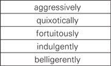
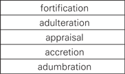
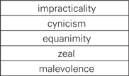
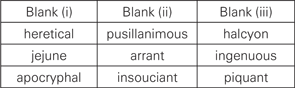
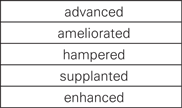
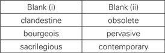
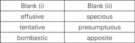
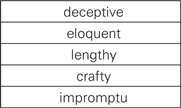
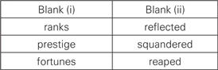
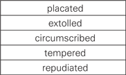

# Princeton Extraction — Sample Review (DB-backed)

Rendered straight from the worktree's persisted DB after the deterministic gates + per-item vision verifier + multi-judge expert review have all run. What you see is exactly what the runtime question screen will serve.

## Before / after — TC option rendering

**Before:** TC items inside the verbal section emitted both the publisher's answer-table GIF (as an ``) AND a bullet list of the vision-extracted options. The user flagged this — embedding the raw GIF on top of the text rendering defeated the whole point of the vision pass.

**After:** every TC item — single-blank, multi-blank, RC-context or stand-alone — renders its choices as a markdown table:

```
**Blank (i)**: A. word | B. word | C. word
**Blank (ii)**: D. word | E. word | F. word
```

The publisher's GIF is no longer embedded anywhere in the rendered review. Zero raw `[img:...]` placeholders remain for TC items.

## Expert review gate (NEW)

Every text-only item that passed the deterministic gates AND the per-item vision verifier is now scored by a 3-model jury (Opus 4.7 + Sonnet 4.6 + Gemini 3.1 Pro) on a 5-axis 1-5 rubric: correctness, clarity, distractor quality, difficulty match, and GRE authenticity. Promotion to `status='live'` requires every axis backed by ≥4 from at least 2 judges, with a spread-of-2 disagreement guard. Items failing the jury land as `status='draft'` with the per-judge breakdown stashed in `Question.review_notes`.

Items whose stem references a chart, geometry diagram, or other figure ride past the text-only jury (`expert_skipped_figure`) and rely on the deterministic gates + vision verifier instead.

## Persistence summary

```json
{
  "source": "princeton_2012",
  "total": 991,
  "live": 543,
  "draft": 448,
  "by_reason": {
    "live:expert_skipped_figure": 188,
    "live:expert_pass": 355,
    "draft:expert_low_axis": 273,
    "draft:expert_judge_disagree": 154,
    "draft:verifier_defect": 17,
    "draft:deterministic_gate_fail": 4
  },
  "expert_calls": 782,
  "elapsed_s": 1.0,
  "expert_review_elapsed_s": 3272.9,
  "estimated_cost_usd": 35.19,
  "defect_distribution": {
    "too_easy_for_tier": 7,
    "difficulty_too_high": 5,
    "trivial_distractors": 4,
    "difficulty_mismatch": 41,
    "too_easy_for_difficulty_3": 12,
    "weak_distractors": 94,
    "trivial_computation": 8,
    "superfluous_given_information": 1,
    "difficulty_too_low_for_tier_3": 2,
    "qc_stem_conflates_circle_label_with_quantity_label": 1,
    "trivially_simple_for_labeled_difficulty": 1,
    "minor_phrasing_issue": 3,
    "ambiguous_referent": 1,
    "missing_initial_volume": 1,
    "ambiguous_reference_cylinder": 1,
    "stem_missing_shared_dimensions": 1,
    "slightly_easy_for_difficulty_3": 1,
    "difficulty_mislabeled": 37,
    "stem_phrasing": 1,
    "stem_ambiguity_circle_inscription": 1,
    "underspecified_square_orientation": 1,
    "incorrect_answer": 19,
    "missing_constraint_on_x": 1,
    "missing_constraint_x_positive": 1,
    "division_by_zero_edge_case": 1,
    "incorrect_answer_key": 21,
    "informal_register": 19,
    "pizza_theme_non_gre": 1,
    "wrong_answer": 15,
    "unsolvable": 10,
    "answer_likely_wrong": 2,
    "ambiguous_density_assumption": 1,
    "unusual_units": 1,
    "non_gre_style": 1,
    "informal_notation": 2,
    "non_standard_terminology": 3,
    "overly_verbose_stem": 1,
    "difficulty_underrated": 8,
    "non_gre_register": 18,
    "ambiguous_wording": 6,
    "unconventional_notation": 1,
    "unstated_assumptions": 1,
    "approximate_answer_imprecision": 1,
    "no_restriction_on_first_letter_unstated": 1,
    "difficulty_overrated": 17,
    "round_number_distractors_not_tied_to_specific_misconceptions": 1,
    "un-gre-like approximation": 1,
    "missing word disclaimer": 1,
    "ambiguous constraints": 2,
    "slightly_awkward_phrasing": 2,
    "missing_strong_distractor": 1,
    "slightly awkward phrasing": 2,
    "ambiguous_stem": 35,
    "unclear_permutation_scope": 1,
    "un-gre-like_phrasing": 1,
    "parse_error": 32,
    "ocr_artifacts": 1,
    "ambiguous_combinations_vs_permutations": 1,
    "wrong_answer_key": 27,
    "no_explanation": 24,
    "hidden_characters": 1,
    "ambiguous stem": 7,
    "answer key questionable": 1,
    "missing explanation": 5,
    "weak_distractor_C": 2,
    "no_explanation_provided": 15,
    "difficulty_overstated": 12,
    "too_easy_for_labelled_difficulty": 13,
    "bare_stem_no_context": 1,
    "indirect_framing": 1,
    "incorrect_terminology": 2,
    "permutation_labeled_as_combination": 1,
    "inaccurate_terminology": 1,
    "must_be_true_phrasing_inappropriate": 1,
    "mutually_exclusive_options": 1,
    "unauthentic_format": 9,
    "unclear_position_constraints": 1,
    "marked_answer_wrong": 2,
    "all_options_miscalculated": 1,
    "stem_underspecified_no_total_code_length": 1,
    "must_be_true_framing_inappropriate_for_deterministic_counts": 1,
    "option_A_and_C_also_wrong_for_different_reasons": 1,
    "distractors_reflect_arbitrary_errors_not_real_misconceptions": 1,
    "unclear_stem": 5,
    "bad_terminology": 2,
    "stem_says_statements_not_values": 1,
    "missing_24_as_option": 1,
    "unidiomatic_phrasing": 2,
    "poor_distractors": 6,
    "missed_negative_root": 1,
    "missing_explanation": 39,
    "difficulty_underestimated": 3,
    "ambiguous_notation": 19,
    "unrendered_formatting": 1,
    "ambiguous_math_notation": 1,
    "wrong_option_text": 2,
    "easier_than_labeled": 6,
    "difficulty_mislabelled": 3,
    "too_easy_for_gre": 3,
    "non_gre_style_arithmetic": 1,
    "unrendered_math": 1,
    "inconsistent_formatting": 2,
    "stem_truncated": 2,
    "missing_inline_math": 9,
    "trivial_for_gre": 3,
    "distractors_partially_implausible": 1,
    "bare_arithmetic_not_gre_style": 1,
    "formatting": 17,
    "unauthentic_stem": 2,
    "ambiguous_domain": 2,
    "noninteger_exponent_of_negative": 1,
    "undefined_for_non-integer_x": 1,
    "missing_integer_constraint": 3,
    "stem_ambiguity": 5,
    "unauthentic_domain": 1,
    "ambiguous notation": 6,
    "unclear formatting": 1,
    "wrong_answer_under_natural_reading": 1,
    "stem_parsing_error": 1,
    "poor_formatting": 8,
    "non-standard phrasing": 2,
    "distractor_A_implausible": 1,
    "unclear_notation": 1,
    "bad_formatting": 2,
    "too_easy": 7,
    "no_conceptual_hook": 1,
    "non_standard_stem_format": 2,
    "weak_distractor_E": 1,
    "trivially_easy": 1,
    "stem_is_expression_not_question": 1,
    "no_imperative_or_prompt": 1,
    "bare_expression_lacks_gre_register": 1,
    "difficulty_likely_too_easy_for_tier_3": 1,
    "missing_interrogative": 1,
    "difficulty_too_low": 8,
    "trivial_for_difficulty_3": 1,
    "distractors_include_implausible_values": 1,
    "overly_simple_for_gre_register": 1,
    "formatting_artifacts": 1,
    "missing_constraints": 5,
    "unrendered_latex": 2,
    "formatting_unclear": 2,
    "formatting_error": 13,
    "missing_punctuation": 3,
    "times_greater_ambiguity": 1,
    "phrasing_defect": 1,
    "difficulty_too_high_for_tier": 1,
    "unformatted_math": 1,
    "non_gre_format": 2,
    "formatting: nested radicals hard to read in plain text": 1,
    "stem_formatting": 4,
    "missing_absolute_value_nuance": 1,
    "difficulty_mislabeled_too_high": 3,
    "trivial_arithmetic_not_gre_appropriate": 2,
    "weak_distractors_E_is_implausible": 1,
    "stem_uses_inline_notation_not_standard_gre_format": 1,
    "un-gre-like stem": 1,
    "G1_option_count": 1,
    "missing_figure": 4,
    "ambiguous_variable_vs_multiplication_symbol": 1,
    "difficulty_overestimated": 1,
    "variable-operator confusion": 1,
    "variable mismatch": 1,
    "stem references undefined variable r": 1,
    "unsolvable as written": 1,
    "stem_missing_variable": 1,
    "typo_r_not_in_equation": 1,
    "fatal_typo": 1,
    "formatting_issue": 3,
    "poor_wording": 1,
    "wrong_option_count": 7,
    "missing_domain_constraint": 1,
    "informal_stem_language": 1,
    "extraneous_solution_x=0_unaddressed": 1,
    "unauthentic_formatting": 2,
    "easy for tier 3": 1,
    "poor_notation": 1,
    "stem_rendering_corrupted": 1,
    "ambiguous_operator_vs_index": 1,
    "stem_uses_rho_instead_of_pq": 1,
    "unclear_variable_relationship": 1,
    "variable_mismatch_rho_vs_p": 1,
    "likely_ocr_corruption": 1,
    "typo": 19,
    "unsolvable_as_written": 3,
    "stem_ambiguity_depth_vs_side": 1,
    "unrealistic_scenario_pure_chlorine": 1,
    "notation_nonstandard_3-root": 1,
    "bad_math_notation": 1,
    "bare expression stem": 1,
    "no question prompt": 2,
    "no units/format guidance": 1,
    "stem_is_bare_expression": 2,
    "no_verbal_wrapper": 1,
    "missing_instruction": 4,
    "incomplete_stem": 3,
    "missing_superscript": 1,
    "no_question_prompt": 1,
    "stem_not_a_question": 1,
    "distractors_not_tied_to_specific_misconceptions": 1,
    "too_mechanical_for_gre_register": 1,
    "multiple_correct_answers": 3,
    "incomplete_answer_key": 1,
    "mcq_multi_with_single_correct_answer": 2,
    "ambiguous_endpoint_inclusive_vs_exclusive": 1,
    "distractors_not_all_plausible_misconceptions": 1,
    "wrong_subtype": 4,
    "stem_missing_original_prices": 1,
    "ambiguous_change_direction": 1,
    "difficulty_too_easy_for_tier": 4,
    "distractors_partially_weak": 1,
    "non_gre_proper_name": 1,
    "trivial_arithmetic": 5,
    "weak distractors": 9,
    "outdated_format": 1,
    "branded_name_non_gre_style": 1,
    "difficulty_too_easy_for_label": 8,
    "missing_question_prompt": 1,
    "stem_incomplete": 1,
    "low_difficulty": 1,
    "incomplete_stem_no_question_asked": 1,
    "stem_is_bare_expression_not_a_sentence": 1,
    "difficulty_likely_overrated_by_one_tier": 1,
    "missing_question_text": 1,
    "below_gre_complexity": 6,
    "weak_distractors_D_and_E": 1,
    "trivialized_by_calculator": 1,
    "below_gre_level": 1,
    "far_too_easy_for_labelled_difficulty_3": 1,
    "not_gre_appropriate_arithmetic": 1,
    "distractors_are_digit_rearrangements_only": 1,
    "below_gre_cognitive_level": 1,
    "punctuation_error": 3,
    "answer depends on sign of n": 1,
    "missing constraint on n": 1,
    "no explanation": 3,
    "wrong_answer_marked": 7,
    "sign_of_n_unspecified": 1,
    "ambiguous_ordering_for_negative_n": 1,
    "stem_references_values_listed_below_but_placement_is_awkward": 1,
    "unmeasured_construct": 1,
    "difficulty_slightly_low": 1,
    "option_C_odd_format": 1,
    "typo_in_option_C": 1,
    "stem_phrasing_awkward": 1,
    "stem_rendering_broken": 1,
    "wrong_variable_in_option_C": 1,
    "options_D_and_E_implausible_as_distractors": 1,
    "likely_OCR_artifacts_from_print_source": 1,
    "typo_in_distractor": 1,
    "poor_math_formatting": 1,
    "awkward_phrasing": 16,
    "easier than tier 3": 2,
    "real_world_framing_atypical_for_gre": 1,
    "option_A_is_inverse_error_not_gre_style": 1,
    "unconventional_formatting": 1,
    "multiple_options_misclassified": 1,
    "C_D_F_G_also_cannot_be_original_count": 1,
    "inconsistent_option_formatting": 1,
    "units swapped in question": 1,
    "answer inconsistent with stem": 1,
    "unit_mismatch_in_stem": 1,
    "swapped_units_in_question_clause": 1,
    "ambiguous_referents": 1,
    "no_distractors_numeric_entry": 2,
    "imprecise_language": 5,
    "too easy for tier 3": 2,
    "lacks GRE phrasing": 1,
    "no_instruction_to_compute": 1,
    "missing_context_or_word_problem_framing": 1,
    "nonstandard_notation": 1,
    "typographic_ambiguity": 1,
    "atypical_format": 1,
    "wrong_answer_marked_correct": 1,
    "option_D_mathematically_incorrect": 1,
    "non_standard_bases_in_options_create_confusion": 1,
    "options_use_mixed_bases_atypical_for_GRE": 1,
    "unusual_format": 1,
    "weak_distractors_A_C": 1,
    "atypical_question_format": 1,
    "irrelevant_info: 6-year history is mentioned but plays no role": 1,
    "stem_uses_invested_ambiguously: 'how much will Teresa have invested' should be 'how much will Teresa's investment be worth'": 1,
    "too_easy_for_difficulty_3: compound-interest formula recognition is difficulty 1-2": 1,
    "weak_distractors: options C and E are implausible to any careful test-taker": 1,
    "non_gre_register: informal name use, vague phrasing, missing dollar signs on options": 1,
    "options_formatting: LaTeX caret notation is raw/unrendered and inconsistent": 1,
    "formatting_artifact": 1,
    "stem_redundancy": 1,
    "broken_stem_formatting": 3,
    "dangling_if_clause": 1,
    "missing_preamble_condition": 1,
    "ascii_math": 1,
    "marked_answer_incomplete: B (11,244) also satisfies B >= 7500": 1,
    "format_mismatch: open inequality yields infinite solutions, ill-suited for select-all-that-apply": 1,
    "distractor_B_should_be_correct": 1,
    "stem_ambiguity: 'at least 1500 more' with no upper bound makes multiple arbitrary options correct": 1,
    "unidiomatic phrasing": 4,
    "typographical error": 1,
    "narrative_fluff": 2,
    "distractor_E_implausible": 1,
    "word_repetition_in_stem": 1,
    "ambiguous interest computation": 1,
    "missing loan term/period": 1,
    "unrealistic finance scenario": 1,
    "ambiguous_interest_term": 1,
    "loan_period_unspecified": 1,
    "non_gre_financial_phrasing": 1,
    "unauthentic_terminology": 1,
    "ambiguous_phrasing": 3,
    "weak_distractors_upper_range": 1,
    "ambiguous_geometry": 2,
    "ambiguous_figure_labeling": 1,
    "no_diagram_provided": 1,
    "vertex_ordering_unclear": 1,
    "no_units_specified": 1,
    "difficulty_too_high_for_straightforward_computation": 1,
    "underspecified": 3,
    "unstated_orientation_assumption": 1,
    "distractor_quality_na": 1,
    "precision_ambiguity": 1,
    "awkward terminology 'right rectangular cylinder'": 1,
    "dimensionally inconsistent distractors": 1,
    "non_standard_terminology: 'right rectangular cylinder' should be 'right circular cylinder'": 1,
    "junk_distractors: options D and E contain r^3 terms, which are dimensionally impossible for surface area": 1,
    "distractor_A_has_mixed_degree_terms: also dimensionally inconsistent": 1,
    "difficulty_slightly_overrated: straightforward substitution is closer to tier 2": 1,
    "answer_key_inverted": 1,
    "incorrect_solution": 1,
    "calculator_dependent_arithmetic": 1,
    "outdated_style": 1,
    "difficulty_too_low_for_label": 2,
    "distractors_arithmetic_only": 1,
    "too_simple": 2,
    "weak_distractor_D": 4,
    "stem_ambiguous_layout": 1,
    "formatting_issues": 2,
    "undefined_domain": 1,
    "stem_rendering_ambiguous": 1,
    "malformed recurrence": 1,
    "broken_recurrence_formula": 1,
    "stem_missing_exponent_notation": 1,
    "unanswerable": 3,
    "contrived_definition": 1,
    "incorrect marked answer": 2,
    "missing constraint on a": 1,
    "unclear_operator_definition": 1,
    "non_standard_symbol": 1,
    "subtype_mismatch": 2,
    "mcq_multi_with_single_answer": 1,
    "domain_violation": 1,
    "domain_violation: operation defined for integers but 3/2 is used": 1,
    "stem_inconsistency: nonzero integers constraint contradicts fractional operand": 1,
    "domain_mismatch": 1,
    "undefined_operation": 1,
    "ambiguous_formatting": 1,
    "poor_stem_formatting": 2,
    "function_definitions_not_clearly_separated": 1,
    "formatting_exponent": 1,
    "stem_wording_awkward": 1,
    "unidiomatic_stem": 1,
    "awkward_geometry_prose": 1,
    "no_figure_provided": 1,
    "stem_wording_informal": 1,
    "non-standard_phrasing": 1,
    "trivial_algebra": 2,
    "below_gre_difficulty_floor": 1,
    "stem_references_expression_without_clear_antecedent": 1,
    "plain_text_formula_rendering": 1,
    "inconsistent_options": 1,
    "malformed_stem": 4,
    "stem_formatting_error": 2,
    "missing_separator_between_conditions": 1,
    "redundant_options": 1,
    "informal_stem_register": 1,
    "poor_formula_typesetting": 1,
    "missing_variable_constraints": 1,
    "older_format_5_options": 1,
    "stem_parsing_unclear": 1,
    "missing_variable_definitions": 1,
    "stem_wordiness": 1,
    "missing_constraint_implicit": 1,
    "soft_register": 1,
    "text_artifact": 1,
    "ambiguous_expression": 1,
    "typo_in_stem": 1,
    "marked_answer_wrong_for_stated_expression": 1,
    "y_variable_unused_as_written": 1,
    "expression_ambiguous": 1,
    "ambiguous_answer": 1,
    "unclear_phrasing": 1,
    "ambiguous_term_factors": 1,
    "awkward_nesting": 1,
    "non_gre_phrasing": 2,
    "multiple_valid_answers_possible": 1,
    "artificial_complexity": 1,
    "correctness_issue": 2,
    "weak_distractors_D_E": 3,
    "correct_answer_questionable": 4,
    "range_includes_zero_incorrectly": 1,
    "marked_answer_wrong_boundary": 1,
    "a_squared_equals_zero_is_achievable": 1,
    "stem_ambiguous_no_constraint_on_a_type": 1,
    "distractors_A_and_B_use_impossible_negative_a_squared": 1,
    "non_gre_style_phrasing": 1,
    "incorrect_correct_answer": 1,
    "gre_style": 1,
    "ambiguous phrasing": 1,
    "ambiguous_phrasing: '(3/4) larger than' vs '(3/4) as large as'": 1,
    "non_ETS_register: 'larger than' instead of 'greater than'": 1,
    "unauthentic_phrasing": 4,
    "incorrect_literal_meaning": 1,
    "too_easy_for_stated_difficulty": 1,
    "excessive_options_for_difficulty": 1,
    "non_standard_notation": 2,
    "minor_wording": 1,
    "trivial arithmetic": 1,
    "difficulty_mislabelled_too_high": 2,
    "no_algebraic_or_conceptual_content": 1,
    "plain_text_expression_formatting": 1,
    "wrong_difficulty": 3,
    "ambiguous_ordering": 1,
    "missing_constraint": 3,
    "ordering_ambiguity": 1,
    "ambiguous_mixed_number_formatting": 1,
    "nonstandard_option_notation": 1,
    "bad formatting": 2,
    "un-GRE math notation": 1,
    "single_correct_in_multi_select": 1,
    "difficulty_slightly_overrated": 1,
    "wrong_subtype_metadata": 1,
    "stem_formatting_ambiguous": 1,
    "weak_distractors_y_and_z": 1,
    "expression_not_typeset_clearly": 1,
    "notation_ambiguity": 1,
    "wrong_answer_keyed": 9,
    "correct_answer_is_obvious_distractor": 1,
    "key_error_systematic": 1,
    "multiple_correct": 1,
    "awkward phrasing": 19,
    "missing_correct_options": 2,
    "correct_options_marked_incorrect": 1,
    "explanation_missing": 4,
    "ambiguous_stem_formatting": 1,
    "missing_condition_separator": 1,
    "stem_missing_positive_integer_constraint": 1,
    "ambiguous_inclusive_exclusive": 1,
    "ambiguous_bounds_language": 1,
    "inconsistent_inclusive_exclusive_phrasing": 1,
    "obscure_phrasing": 1,
    "trivial_once_decoded": 1,
    "trivial once parsed": 1,
    "informal_phrasing": 1,
    "un-gre_phrasing": 1,
    "unusual_option_format": 1,
    "convoluted_phrasing": 1,
    "overly_wordy_stem": 1,
    "non_standard_option_format": 1,
    "un-gre-like-phrasing": 1,
    "awkward_verbal_phrasing": 1,
    "irrelevant_quantities": 1,
    "question_likely_mistyped_xy_z_vs_x_z": 1,
    "lowercase_variables_non_gre_style": 1,
    "verbose_word_problem_encoding": 1,
    "stem_uses_lowercase_non_gre_convention": 1,
    "awkward_stem_phrasing": 1,
    "soft_hyphen_artifact_in_stem": 1,
    "missing integer constraints": 1,
    "informal phrasing": 1,
    "formatting typo": 1,
    "ambiguous_setup": 1,
    "ambiguous_factorization_uniqueness": 1,
    "non_ets_puzzle_style": 1,
    "wrong_correct_answer": 5,
    "nonstandard phrasing": 1,
    "non_standard_phrasing": 3,
    "ambiguous-stem": 3,
    "questionable-correctness": 1,
    "atypical-phrasing": 1,
    "awkward_phrasing_of_y_constraint": 1,
    "equation_reference_says_above_but_is_inline": 1,
    "roundabout_way_to_say_y=1_may_confuse_test_takers": 1,
    "non_standard_register": 1,
    "ambiguous_zero_case": 1,
    "math_error": 1,
    "nonsense_distractors": 1,
    "correct_answer_is_option_B_not_D": 1,
    "stem_ambiguous_ratio_direction": 1,
    "distractors_C_and_D_are_unmotivated_expressions": 1,
    "stem_phrasing_awkward_nonstandard": 1,
    "unintended_shortcut": 1,
    "redundant_information": 1,
    "correctness-questionable": 2,
    "option-B-trivially-true": 1,
    "option-D-requires-extra-condition": 1,
    "ambiguous-variables": 1,
    "no-explanation": 1,
    "wrong_answer_key: option_B_is_always_true_so_must_be_correct": 1,
    "wrong_answer_key: option_F_can_be_true_when_x=0_y=0": 1,
    "option_B_merely_restates_the_premise_making_it_a_trivial_distractor": 1,
    "stem_variable_constraints_unstated": 1,
    "incorrect_key": 1,
    "junk_options": 2,
    "answer depends on interpretation": 1,
    "options_not_ordered_consistently": 1,
    "edge-case-G": 1,
    "ambiguous_divisibility_direction": 1,
    "unusual_question_direction": 1,
    "malformed stem": 2,
    "missing math notation": 1,
    "ambiguous expressions": 1,
    "stem_garbled": 1,
    "coordinates_malformed": 1,
    "duplicate_sqrt2_in_stem": 1,
    "answer_unverifiable_due_to_corrupt_stem": 1,
    "non_gre_format_five_options_with_parabola_distance": 1,
    "ambiguous coordinates": 1,
    "incorrect answer computation": 1,
    "rendering_artifact_in_stem": 1,
    "dangling_sqrt3_fragment": 1,
    "negative_distractor_not_plausible": 1,
    "G2_distractor_unique": 1,
    "non_ets_register": 1,
    "contradictory_information": 1,
    "answer_does_not_compute": 1,
    "non_gre_style_narrative": 1,
    "ambiguous_discount_fee_order": 1,
    "multi_step_word_problem_convoluted": 1,
    "distractor_rationale_unclear": 1,
    "missing_information": 7,
    "equation_placement": 1,
    "equation_displaced_in_stem": 1,
    "minor ambiguity in discount wording": 1,
    "mixed units (dollars and cents)": 1,
    "ambiguous_discount_phrasing": 1,
    "unclear_treatment_of_remainder_bagels": 1,
    "missing_dollar_sign_for_x_in_stem": 1,
    "implausible_distractor_A": 1,
    "implausible_distractor_B": 1,
    "arc_PSQ_is_2/3_not_1/3": 1,
    "truncated_stem": 1,
    "missing_equation_rhs": 1,
    "rendering_artifact": 1,
    "between_ambiguous_exclusive_vs_inclusive": 1,
    "difficulty_likely_too_low_for_tier_3": 1,
    "option_D_marked_correct_but_fails_both_constraints": 1,
    "ambiguous rate language": 1,
    "awkward phrasing 'times greater'": 1,
    "ambiguous_rate_language": 1,
    "below_difficulty_label": 1,
    "correctness_check": 1,
    "no_domain_constraint_discussion": 1,
    "imprecise phrasing": 1,
    "missing units": 1,
    "too_easy_for_labeled_difficulty": 3,
    "distractors_not_well_motivated": 1,
    "numeric_entry_would_be_more_appropriate": 1,
    "not_gre_authentic_five_option_arithmetic": 1,
    "below_labeled_difficulty": 3,
    "elementary_word_problem_register": 1,
    "poor_phrasing": 3,
    "stem_contradictory_phrasing": 1,
    "except_plus_multiselect_conflict": 1,
    "non_gre_instruction_language": 1,
    "ungrammatical": 1,
    "authenticity_flaw": 1,
    "contradictory_instructions": 1,
    "mislabeled_subtype": 1,
    "marked_answer_incorrect": 1,
    "inconsistent_conditions": 1,
    "soft_hyphen_in_stem": 1,
    "grammar": 4,
    "non_standard_qc_phrasing": 1,
    "ambiguous_universal_vs_existential": 1,
    "non_gre_variable_setup": 1,
    "non_standard_quantity": 1,
    "formatting: equations run together": 1,
    "missing_fraction_in_stem": 1,
    "transcription_error": 1,
    "stem_ambiguous_without_assumed_value": 1,
    "missing_word": 1,
    "weak_distractor_B_circular": 1,
    "too_easy_for_tier_3": 1,
    "tautological_distractor_B": 1,
    "junk_distractor": 4,
    "answer_should_be_D": 3,
    "formatting:notation": 1,
    "distractor:malformed_option_D": 1,
    "informal_math_notation": 1,
    "ambiguous_distractor_D": 1,
    "no positivity constraint on m — formula breaks for negative odd integers": 1,
    "options A and B use m/2 which is non-integer for odd m, making them trivially eliminable": 1,
    "distractor E (2m+1) is implausibly large and easily eliminated": 1,
    "undefined_variable": 1,
    "undefined_variable_w": 1,
    "stem_missing_constraint_on_w": 1,
    "formatting_error_no_line_break_between_conditions": 1,
    "cannot_verify_correct_answer_without_knowing_w": 1,
    "stem_ambiguous": 2,
    "unintended_math_error": 1,
    "easier_than_labelled": 1,
    "below_labelled_difficulty": 1,
    "ascii_math_notation": 1,
    "ambiguous_x": 1,
    "undefined_quantity_for_odd_x": 1,
    "ambiguous_constraints": 1,
    "stem_lacks_integer_constraint": 1,
    "condition_does_not_constrain_x_sufficiently": 1,
    "sqrt(7)_benchmark_unmotivated": 1,
    "pizza_context_slightly_non_GRE": 1,
    "incorrect_marked_answer": 1,
    "missing_lower_bound": 1,
    "ambiguous_constraint": 1,
    "answer_not_unique": 1,
    "only_three_options_unusual": 1,
    "distractor_obviously_wrong": 1,
    "minor_typo_replacements": 1,
    "stem_typo: 'without replacements' should be 'without replacement'": 1,
    "option_C_distractor_algebra: second factor (y-x)/(x+y+z-1) uses x rather than 1, making it obviously nonsensical rather than subtly wrong": 1,
    "notation_inconsistency: option B uses period as multiplication symbol instead of asterisk or parentheses used elsewhere": 1,
    "only_three_options: genuine mcq_multi items typically have 4-6 options for meaningful discrimination": 1,
    "difficulty_label: with only three options and one clearly nonsensical distractor, effective difficulty is lower than labeled 3": 1,
    "unplausible_distractors": 1,
    "incorrect answer key": 1,
    "wordy_stem": 1,
    "redundant_phrasing": 1,
    "weak_distractors_B_C_E_F": 1,
    "wrong_terminology": 1,
    "minor_wording_issue": 1,
    "edge case f=0": 1,
    "ambiguous definition of fraction": 1,
    "incorrect answer key for B,C,E": 1,
    "ambiguous_term: 'fraction' is undefined — does it include 0?": 1,
    "if_f=0_all_three_correct_answers_fail_strict_inequality": 1,
    "correctness_contingent_on_unstated_assumption_f_nonzero": 1,
    "imprecise_terminology": 1,
    "stem_ambiguity_minor": 1,
    "mode-uniqueness-issue": 1,
    "subtype-mismatch": 1,
    "formatting_unclear_list": 1,
    "sign_ambiguity": 2,
    "answer_depends_on_unstated_assumption": 1,
    "unconstrained_variables": 1,
    "missing_constraint_x_y_positive": 1,
    "ambiguous_answer_without_domain_restriction": 1,
    "independence not stated": 1,
    "non-standard notation": 1,
    "unusual algebraic form": 1,
    "independence_not_stated": 1,
    "missing_domain_constraints_on_x": 1,
    "probability_validity_not_ensured": 1,
    "algebra_drill_not_probability_concept": 1,
    "non_gre_style_variable_in_probability": 1,
    "unwarranted_assumption": 1,
    "awkward phrasing: 'median of the first two numbers'": 1,
    "median_of_two_numbers_unnatural": 1,
    "order-ambiguity": 1,
    "order_ambiguity_quantity_A": 1,
    "order_ambiguity_quantity_B": 1,
    "answer_flips_under_alternate_interpretation": 1,
    "awkward phrasing with trailing equals sign": 1,
    "stem_ends_with_equals_sign": 1,
    "question_phrasing_non_standard": 1,
    "minor_formatting": 1,
    "non-gre-context": 1,
    "ambiguous_percentage_base": 1,
    "named_student_middle_school_context": 1,
    "interpretation_makes_option_E_plausible_correct": 1,
    "un-gre-like_language": 1,
    "unclear what is being computed": 1,
    "non-GRE phrasing": 1,
    "answer 17/15 exceeds 1 (impossible probability)": 1,
    "stem_ambiguous_which_probability_per_street": 1,
    "stem_does_not_clarify_john_could_be_on_either_street": 1,
    "stem_asks_two_questions_in_one_without_clear_structure": 1,
    "option_E_impossible_probability_greater_than_1": 1,
    "non_gre_narrative_style": 1,
    "answer verification questionable": 1,
    "un-GRE_language": 1,
    "median-depends-on-x": 1,
    "missing-explanation": 1,
    "question_wording": 1,
    "non_gre_register_named_characters": 1,
    "real_world_framing_below_gre_standard": 1,
    "wrong_answer_or_ambiguous": 1,
    "mcq_multi_with_single_correct": 1,
    "stem_specifies_integers_but_x_range_open": 1,
    "median_must_be_integer_given_set": 1,
    "subtype mismatch": 2,
    "misleading phrasing": 1,
    "junk distractor": 1,
    "unsimplified_fraction": 1,
    "awkward_double_if_construction": 1,
    "unsimplified_correct_label": 1,
    "slightly_overrated_difficulty": 1,
    "colloquial_context": 1,
    "stem_ends_awkwardly": 1,
    "informal tone": 1,
    "imprecise terminology": 1,
    "non-standard phrasing: 'regular distribution' instead of 'normal distribution'": 1,
    "informal narrative framing (coffee spill story) inconsistent with GRE register": 1,
    "'third standard deviation to the left' is non-standard; GRE says 'three standard deviations below the mean'": 1,
    "no explanation provided": 1,
    "distractors 85 and 100 are only marginally motivated as misconception traps": 1,
    "unauthentic_tone": 3,
    "missing_starting_condition": 1,
    "atypical_phrasing": 1,
    "ambiguous_stem_overtake_meaning": 1,
    "non_gre_flavor_text": 1,
    "fictional_proper_nouns": 1,
    "informal_punctuation": 1,
    "option_G_meta": 1,
    "contraction_in_option_G": 1,
    "meta_option_G_not_GRE_style": 1,
    "stem_says_statements_but_options_are_operations": 1,
    "option_G_is_non_standard_catch-all_distractor": 1,
    "un-gre distractor": 1,
    "missing leading zero": 1,
    "not-standard-gre-format": 1,
    "duplicate_correct_answers": 1,
    "mcq_multi_misuse": 1,
    "gre_style_violation": 1,
    "weak_distractor_G": 1,
    "non_gre_option_phrasing": 1,
    "slang_in_stem": 1,
    "assumes_independence_unstated": 1,
    "unnecessary_narrative_detail": 1,
    "informal_tone": 1,
    "trivial_algebraic_identity": 1,
    "not_gre_authentic": 1,
    "below_gre_register": 3,
    "ambiguous_variable_value": 1,
    "option_B_is_also_correct": 1,
    "too_many_options_for_mcq_multi": 1,
    "stem_typo": 1,
    "unrealistic_options": 1,
    "difficulty_too_easy_for_labeled_tier": 1,
    "difficulty_too_easy_for_tier3": 2,
    "distractor_D_and_E_implausible": 1,
    "too_simple_for_gre_quant": 1,
    "stem_missing_punctuation": 1,
    "stem_awkward_phrasing": 3,
    "distractors_too_easy_to_eliminate": 1,
    "too_many_options_for_simple_quadratic": 1,
    "stem_formatting_broken": 1,
    "quantity_A_missing_or_garbled": 1,
    "ambiguous_which_expression_is_which_quantity": 1,
    "mangled_formatting": 1,
    "bare_expression_stem": 1,
    "no_question_phrasing": 1,
    "plain_text_math_notation": 1,
    "no_domain_restriction_stated": 1,
    "numeric_entry_algebra_unusual": 1,
    "distractors_not_plausible": 1,
    "difficulty_too_high_for_item": 1,
    "item_too_easy_for_difficulty_3": 1,
    "weak_textual_support": 1,
    "adjective_not_directly_used": 1,
    "missing_passage_reference_in_stem": 2,
    "weak_distractors_radiant_and_anarchic": 1,
    "stem_requires_passage_but_passage_not_labeled": 1,
    "answer_inferential_not_explicit": 1,
    "un-gre-like": 3,
    "false_positive_distractor": 1,
    "stem_lacks_passage_reference": 3,
    "weak_distractors_C_and_D": 2,
    "distractor_E_arguably_inferable": 1,
    "difficulty_label_possibly_low": 1,
    "factual_error": 3,
    "passage_contradiction_in_correct_answer": 1,
    "ambiguous_question_phrasing": 1,
    "passage_says_opioids_block_autoperfusion_not_enable_it": 1,
    "poor_stem": 1,
    "unauthentic_stimulus": 1,
    "question_mismatch": 1,
    "answer_questionable": 1,
    "correct_answer_dubious": 1,
    "stem_references_content_not_clearly_in_passage": 1,
    "answer_C_vague_and_hard_to_defend": 1,
    "imprecise correct option": 1,
    "competing_answer_possible": 1,
    "vague_correct_answer": 1,
    "no_passage_reference": 1,
    "ambiguous_correct_answer": 3,
    "distractor_overlap": 2,
    "weak_distractors_B_and_C": 1,
    "option_D_vague": 1,
    "stimulus_too_short_for_rc_primary_purpose": 1,
    "un-gre-like options": 1,
    "label_without_options": 1,
    "correct_label_unverifiable": 1,
    "no_sentence_labels_in_stimulus": 1,
    "missing_options": 1,
    "unresolvable_correct_label": 1,
    "awkward NOT-unique phrasing": 1,
    "C wording overlaps with stem logic": 1,
    "double-negation_ambiguity": 1,
    "instructions_redundant_in_stem": 1,
    "distractor_C_debatable": 1,
    "imprecise_stem": 1,
    "passage_contradicts_key": 1,
    "imprecise_key": 2,
    "minor_spelling_surmissed": 1,
    "typo_in_option_E: 'surmissed' should be 'surmised'": 1,
    "distractor_D_partially_correct: the passage implies Madison accepted factions as inevitable, making D a plausible competing answer": 1,
    "distractor_B_implausible: population growth as a reason to check factions has no grounding in the stimulus or in general knowledge, making it a junk distractor": 1,
    "difficulty_too_easy_for_tier3: the answer is directly stated in the first sentence of the stimulus, making this more of a tier-1 or tier-2 item": 1,
    "gre_register: option E contains a misspelling and distractor B is nonsensical, both inconsistent with ETS standards": 1,
    "difficulty_mismatch_too_easy_for_tier_3": 1,
    "ambiguity_C": 1,
    "option_A_ambiguous_correctness": 1,
    "distractor_A_too_close_to_correct": 1,
    "distractor_C_partially_true": 1,
    "unsupported_correct_option": 1,
    "ambiguous_distractor": 1,
    "un-gre_reasoning": 1,
    "weak_distractor_B": 1,
    "distractor_D_too_obviously_wrong": 1,
    "difficulty_mismatch_easy": 4,
    "no_options_list": 1,
    "difficulty_mismatch_mild": 1,
    "select_sentence_trivial": 1,
    "all-correct-answers": 1,
    "all_options_correct": 1,
    "no_wrong_answer_to_discriminate": 1,
    "answer not well-supported": 1,
    "stem_depends_on_missing_passage_context": 1,
    "stem_phrasing_nonstandard": 1,
    "distractor_B_and_D_too_easy_to_eliminate": 1,
    "distractor_C_partially_grounded_but_weak": 1,
    "authenticity_issue": 1,
    "poor_option_phrasing": 1,
    "correctness:A-also-supported": 1,
    "correctness:B-also-supported": 1,
    "marked_answer_unsupported": 1,
    "answer_A_plausibly_correct": 1,
    "answer_B_plausibly_correct": 1,
    "unsupported_key": 1,
    "mild ambiguity": 1,
    "stem_references_definition_not_in_passage": 1,
    "distractor_A_vague_and_tangential": 1,
    "distractor_C_arguably_correct_per_stimulus": 1,
    "option_E_could_be_defensible": 1,
    "un-gre_tone": 1,
    "no_options_provided": 2,
    "task_type_mismatch_for_rc_select": 1,
    "stem_ambiguity_author_agreement_unclear": 1,
    "non_standard_format_for_gre_rc_select": 1,
    "imprecise_wording": 1,
    "stem_requires_passage_context_not_fully_self_contained": 1,
    "stem_ambiguous_inference_scope": 1,
    "weak_distractors_not_clearly_grounded_in_passage_misconceptions": 1,
    "explanation_empty": 2,
    "false_inference": 1,
    "answer_mismatch": 1,
    "options_dont_address_question": 1,
    "stem_answer_mismatch": 1,
    "stem_asks_about_préciosité_seventeenth_century_view_but_correct_answers_do_not_address_that": 1,
    "option_B_not_supported_by_passage": 1,
    "stem_question_inconsistent_with_correct_answers": 1,
    "option_A_addresses_literature_as_protest_not_how_préciosité_was_viewed": 1,
    "stem_option_mismatch": 1,
    "single-correct in multi-select format": 1,
    "stem ambiguous about scope": 1,
    "correct_answer_mismatch": 3,
    "weak_contrast": 1,
    "no_explicit_contrast_sentence": 1,
    "select-in-passage_format_incomplete": 1,
    "stem_ambiguity_contrast_not_fully_explicit": 1,
    "difficulty_label_questionable": 2,
    "flawed_logic": 1,
    "stem_requires_passage_reference_without_quoting_sentence": 1,
    "distractor_B_introduces_unsupported_pacifist_claim": 1,
    "distractor_E_is_implausible_nonsense": 1,
    "clarity_depends_on_knowing_which_sentence_is_referenced": 1,
    "authenticity": 1,
    "incomplete_sentence": 1,
    "truncated_correct_answer": 1,
    "tone_and_style": 1,
    "stem_grammar": 1,
    "answer_key_questionable": 1,
    "stem_truncated_or_incomplete": 1,
    "correctness_of_B_questionable": 1,
    "stem_grammar_awkward": 1,
    "ambiguous_pattern": 1,
    "informal_language": 3,
    "grammar_error": 2,
    "easier than labeled": 1,
    "stem_ambiguity_no_passage_reference": 1,
    "difficulty_too_low_for_label_3": 1,
    "weak_distractors_A_and_D": 1,
    "passage_presents_both_anthropogenic_and_natural_causes_making_B_only_partially_correct": 1,
    "un-ETS distractors": 1,
    "question-passage mismatch": 1,
    "terminological confusion": 1,
    "stem_misleads_on_content": 1,
    "passage_attribution_error": 1,
    "inaccurate_stem": 1,
    "ambiguous_target": 1,
    "distractor B arguably defensible via global warming chain": 1,
    "some distractors loosely tied to passage": 1,
    "A-specificity-debatable": 1,
    "C-inference-stretch": 1,
    "option_A_ambiguity": 1,
    "correctness_concern_option_A": 1,
    "option_C_tangential": 1,
    "unauthentic_key": 1,
    "grammatical error in stem": 2,
    "stem-option redundancy": 1,
    "stem_fragment_redundancy": 1,
    "stem_option_overlap": 1,
    "passage_support_weak_for_correct_answer": 1,
    "missing_passage_in_json": 1,
    "minor_grammar_in_stem": 1,
    "no_distractors_for_scoring": 1,
    "stem_phrasing_slightly_awkward": 1,
    "difficulty_mismatch_easy_for_tier3": 1,
    "option_A_truncated": 1,
    "distractor_D_misrepresents_passage": 1,
    "distractor_E_off_topic": 1,
    "stem_relies_heavily_on_stimulus_context": 1,
    "broken_distractor": 1,
    "only_three_options": 1,
    "weak_distractor_mausoleums": 1,
    "passage_cohesion": 1,
    "no_options_for_select_sentence": 1,
    "trivial_locate_task": 1,
    "option-A-also-defensible": 1,
    "correctness_ambiguous_A": 1,
    "distractor_A_plausibly_correct": 1,
    "correctness_B_weak_fit": 1,
    "inaccurate_options": 1,
    "un-gre_format": 1,
    "imprecise_vocabulary": 1,
    "ambiguous_correctness": 1,
    "passage_contradiction": 1,
    "NOT-true logic inverted for rc_multi format": 1,
    "answer_key_inconsistency": 1,
    "stem_ambiguity_not_true_plus_select_all": 1,
    "passage_not_provided_in_stem_field": 1,
    "passage_error": 1,
    "poor_grammar": 1,
    "factual error in stimulus": 1,
    "weak GRE register": 1,
    "implausible_wrong_options": 3,
    "passage_mismatch_distractors": 1,
    "poor_passage_quality": 1,
    "uncharacteristic_grammar": 1,
    "missing_stimulus_in_stem_context": 1,
    "ambiguous_weakener_logic": 1,
    "no_options_to_evaluate": 1,
    "trivial_identification_task": 1,
    "correct_answer_debatable": 1,
    "option_A_near_synonym_of_C": 1,
    "title_question_not_standard_GRE_rc_format": 1,
    "flawed_correct_answer": 1,
    "ambiguous_options": 1,
    "awkward stem wording": 1,
    "ambiguous correct answer": 1,
    "EXCEPT_with_select_all_conflict": 1,
    "logical_contradiction_in_stem": 2,
    "incorrect_answer_marking": 1,
    "option_A_partially_supported_by_passage": 1,
    "option_C_contradicts_passage": 1,
    "confusing_stem": 1,
    "stem_vague": 1,
    "stimulus_typos": 1,
    "stem_references_nonexistent_paragraph_structure": 1,
    "answer_C_is_a_prerequisite_not_a_proposed_solution": 1,
    "ambiguous_referent_final_paragraph": 1,
    "minor_typos": 1,
    "low_gre_authenticity": 1,
    "stem_missing_conditional_word_if": 1,
    "stem_uses_lowercase_variable": 1,
    "stem_formatting_non_standard": 1,
    "grammar_issue": 1,
    "informal_context": 1,
    "real_world_implausibility": 1,
    "ambiguous_cost_structure": 1,
    "un-GRE_phrasing": 1,
    "confusing instruction": 1,
    "asks for percent not ratio": 1,
    "mcq_multi_misused_single_answer": 1,
    "stem_says_ratios_not_percentages": 1,
    "select_all_inappropriate_for_deterministic_calculation": 1,
    "wrong_format": 1,
    "confusing_wording": 1,
    "implicit_positivity_assumption": 1,
    "variable_naming_ambiguity": 1,
    "bland_context": 1,
    "imprecise wording": 1,
    "difficulty mismatch": 1,
    "missing_chart": 1,
    "unverifiable_answer": 1,
    "ambiguous_reference": 1,
    "missing_chart_data": 1,
    "stem_references_nonexistent_figure": 1,
    "unverifiable_correct_answer": 2,
    "companies_M_and_B_undefined_without_chart": 1,
    "missing_stimulus": 1,
    "missing_data": 1,
    "unverifiable": 1,
    "context_dependent": 1,
    "missing_data_source": 1,
    "stem_references_external_graphic_not_provided": 1,
    "cannot_solve_without_chart": 1,
    "missing_context": 1,
    "correct_answer_not_among_options": 1,
    "format_mismatch": 1,
    "stem_uses_parentheses_for_fractions_informally": 1,
    "numeric_entry_expects_fraction_but_GRE_numeric_entry_typically_expects_single_number_or_decimal": 1,
    "missing_format_instruction": 1,
    "easier-than-labeled": 1,
    "non_gre_name": 1,
    "weak synonym pair": 6,
    "se_requires_exactly_two_synonymous_answers": 1,
    "D_and_F_not_true_synonyms": 1,
    "C_monumental_could_also_fit_logically": 1,
    "stem_ambiguity_what_kind_of_impact": 1,
    "virulent_misfit_distractor": 1,
    "clunky_prose": 1,
    "non-synonymous pair": 2,
    "taciturn vs uncommunicative not equivalent sentences": 1,
    "ambiguous_contrast_structure": 1,
    "distractor_E_usage_issue": 1,
    "correct_pair_not_fully_synonymous": 1,
    "answers not synonymous": 2,
    "aplomb is a noun (grammar mismatch)": 1,
    "weak sentence logic": 1,
    "second-correct-answer-weak": 1,
    "distractor-C-wrong-part-of-speech": 1,
    "logic-gap-quiescent-vs-bucolic": 1,
    "stem-logic-partially-strained": 1,
    "no_valid_pair": 1,
    "grammar_mismatch": 1,
    "misspelling: 'unfavorablely'": 1,
    "awkward stem phrasing": 1,
    "spelling_error_in_option_C": 1,
    "weak_distractors_A_and_F": 1,
    "stem_provides_content_not_purely_contextual_clue": 1,
    "difficulty_likely_overrated": 1,
    "spelling_error": 1,
    "weak_distractor:viscosity": 1,
    "weak_distractor_viscosity": 1,
    "minor_distractor_implausibility": 1,
    "synonym_mismatch": 1,
    "no_equivalent_pair": 1,
    "se_synonym_pair_imperfect": 1,
    "limpid_distractor_off_topic": 1,
    "innocuous_distractor_off_topic": 1,
    "weak_synonym_pair": 14,
    "weak_synonymy": 3,
    "semantic_mismatch": 2,
    "incorrect_answer_pair": 1,
    "semantic_mismatch_between_correct_answers": 1,
    "non_parallel_correct_options": 1,
    "stygian_gloomy_not_equivalent": 1,
    "informal_scenario": 1,
    "weak_distractors_E_F": 1,
    "difficulty_mismatch_stygian_is_hard_vocab": 1,
    "cacophonous_clashes_with_context_too_obviously": 1,
    "logic slightly muddled": 1,
    "logical_tension_in_stem": 1,
    "distractor_overlap_with_correct": 3,
    "weak_distractors_D_F": 1,
    "dangling_modifier": 2,
    "se_pair_not_synonymous": 1,
    "historical_accuracy_issue": 1,
    "weak_sentence_logic": 1,
    "distractor_B_could_fit": 1,
    "weak_synonyms": 1,
    "ungrammatical_distractor": 3,
    "non-standard_se_format": 1,
    "colloquial_options": 1,
    "non_standard_formatting": 1,
    "critical/constructive differ in meaning": 1,
    "correct_pair_not_synonymous": 1,
    "SE_synonym_requirement_violated": 1,
    "distractors_too_easy": 4,
    "weak_se_structure": 1,
    "synonym_pair_weak": 2,
    "thoughtlessly_not_synonym_of_flippantly": 1,
    "logic_flaw_in_stem": 1,
    "answer_pair_not_synonymous_enough": 1,
    "weak_distractor_synonymy": 1,
    "junk_distractors": 2,
    "distractors_are_jokes_not_misconceptions": 1,
    "stem_too_colloquial": 1,
    "tone/style": 1,
    "imperfect_synonyms": 1,
    "logic_inversion": 1,
    "logic_inverted": 1,
    "near_synonymous_distractors_B_C": 1,
    "correct_pair_A_E_marked_wrong": 1,
    "distractor_pair_C_F_too_obscure_and_irrelevant": 1,
    "distractor_D_pulchritudinous_nonsensical_in_context": 1,
    "difficulty_likely_higher_than_tier_3": 1,
    "stem_overly_long_and_content_heavy_for_se_format": 1,
    "unnatural_phrasing": 1,
    "non-synonym pair": 1,
    "anhydrated not standard English": 1,
    "vocabulary too obscure": 1,
    "difficulty mislabeled": 1,
    "distractor_too_weak": 1,
    "anhydrated_questionable": 1,
    "dubious_key": 1,
    "unrealistic_vocabulary": 1,
    "insufficient_context_clue": 1,
    "extraneous_synonym_pair": 1,
    "humorous_register": 1,
    "stem_logic_gap": 1,
    "tone_too_informal": 2,
    "dangling modifier": 1,
    "non-GRE register": 2,
    "atypical_could_be_argued_correct": 1,
    "stem_uses_contraction_informal_tone": 1,
    "correct_answers_debatable": 1,
    "augment_vs_escalate_not_synonymous_enough": 1,
    "stem_logic_questionable": 1,
    "mitigate_could_be_argued_correct": 1,
    "unidiomatic_expression": 2,
    "grammatical error": 1,
    "grammar_error: 'defense' should be 'defend'": 1,
    "awkward_phrasing: 'cannot develop a logical argument to defend' is convoluted": 1,
    "se_format_violation: SE items require exactly six options with exactly two correct synonymous answers; 'maxim' and 'proverb' are near-synonyms but the sentence context muddies whether 'fallacy' could also plausibly fit": 1,
    "register: informal and slightly tendentious tone atypical of ETS": 1,
    "ambiguity: 'fallacy' is arguably defensible given the sentence's logic context, undermining uniqueness of the two correct answers": 1,
    "grammatical_error": 1,
    "stem_structural_flaw": 1,
    "ambiguous_blank_referent": 1,
    "se_format_violation": 1,
    "typo: 'than' should be 'that'": 1,
    "wile typically used in plural 'wiles'": 1,
    "typo_in_stem: 'than' should be 'that'": 1,
    "singular_answer_choice: 'wile' is nearly always used in plural ('wiles'); using the singular form makes E awkward and arguably incorrect in context": 1,
    "stem_logic_weak: the unfalsifiability of astrology does not directly follow to vulnerability to deception — the logical bridge is loose": 1,
    "distractor_C_and_D_too_easy: 'vindication' and 'authentication' are near-antonyms that are trivially eliminable": 1,
    "difficulty_label_questionable: item skews easier than difficulty-3 due to weak distractors": 1,
    "obscure_distractor": 1,
    "distractor_calumniating_off_topic": 1,
    "arguable-key": 1,
    "context-supports-squeamish/stodgy": 1,
    "ambiguous_clue_word": 1,
    "competing_correct_pair": 1,
    "stem_logic_tension": 1,
    "stem_over_scaffolded": 1,
    "simplistic_sentence": 1,
    "unnecessary_comma": 1,
    "comma_splice_in_stem": 1,
    "weak_distractors_B_C": 1,
    "stem_punctuation_awkward": 1,
    "punctuation error": 1,
    "casual_register": 1,
    "non_gre_register_stem": 1,
    "urban_and_rustic_implausible_distractors": 1,
    "subtilize/rarefy not true synonyms in context": 1,
    "awkward stem": 2,
    "spur/incite is a stronger synonym pair but wrong meaning": 1,
    "obscure_vocabulary_mismatch": 1,
    "stem_logic_unclear": 2,
    "poor option quality": 1,
    "semantic_redundancy_with_clue": 1,
    "se_format_violation: SE stems require two blanks, not one": 1,
    "stem_redundancy: 'semi-transparent' in the stem nearly defines 'diaphanous'/'gossamer', making the answer too gettable": 1,
    "distractor_natatory: 'natatory' (relating to swimming) is off-topic/nonsensical as a visual descriptor, making it an obviously wrong outlier": 1,
    "trivial_name_in_stem: using the scientific name adds nothing and slightly clutters the stem": 1,
    "pop-culture content": 1,
    "imprecise synonym pair": 1,
    "pop_culture_content": 1,
    "non_gre_subject_matter": 1,
    "answer_pair_not_truly_interchangeable": 1,
    "pop_culture_reference": 2,
    "unauthentic_content": 1,
    "synonym_pair_not_equivalent": 1,
    "neoteric_uncommon_register": 1,
    "neoteric_questionable_fit": 1,
    "exorbitant_wrong_category": 1,
    "iniquitous_irrelevant_distractor": 1,
    "answer_pair_not_perfectly_synonymous": 1,
    "unidiomatic": 2,
    "poor_synonyms": 1,
    "non_gre_distractors": 1,
    "slightly_easy_se": 1,
    "awkward_comparative_construction": 1,
    "more_X_than_advisors_grammatically_odd": 1,
    "partisans_could_arguably_fit": 1,
    "se_requires_two_blanks_not_one": 1,
    "perigee_means_low_point": 1,
    "zenith_synonym_of_apogee_omitted": 1,
    "wrong_correct_answer_pair": 1,
    "near_synonym_pair_flawed": 1,
    "grammar_error_may_vs_might": 1,
    "distractor_F_zenith_is_synonymous_with_correct_answers": 1,
    "intransitive_distractors": 1,
    "intransitive_verb_misuse": 1,
    "non_gre_vocabulary_choices": 1,
    "grammatical_mismatch": 1,
    "flawed_distractors": 1,
    "context_mismatch": 1,
    "typo_discrete_vs_discreet": 1,
    "discrete_vs_discreet_spelling_error": 1,
    "distractors_too_obvious": 3,
    "se_answer_pair_not_perfectly_synonymous": 1,
    "loose_logic": 1,
    "easy_vocabulary": 1,
    "weak synonymy": 2,
    "stem relies on political assumption": 1,
    "non_gre_topic_register": 1,
    "only_one_viable_distractor_pair": 1,
    "lacks_synonym_pairs": 1,
    "greed_avarice_synonymy_too_obvious": 1,
    "weak_se_construction": 1,
    "synonym mismatch": 1,
    "redundant clue": 1,
    "se_requires_synonym_pair": 1,
    "A_and_F_not_synonyms": 1,
    "stem_redundancy_calamitous_cataclysm": 1,
    "weak_distractors_C_E_too_easy_to_eliminate": 1,
    "single_blank_se_format_violation": 1,
    "simplistic stem": 1,
    "answers_not_synonymous": 1,
    "pleonasm": 2,
    "missing trap pairs": 1,
    "cogency_lucidity_not_synonyms": 1,
    "marked_answer_questionable": 1,
    "cogency_mismatch_with_stem_logic": 1,
    "roethke_the_waking_is_famously_ambiguous_not_lucid": 1,
    "se_format_requires_synonymous_pair": 1,
    "ameliorate_misuse": 1,
    "non-parallel_contrast": 1,
    "obscure_distractor_vilipend": 1,
    "weak_distractor_engender": 1,
    "informal_register_mid-2000s": 1,
    "se_requires_synonymous_pair": 2,
    "no_decoy_pair": 1,
    "platitudinous/jejune not true synonyms": 1,
    "distractor_too_easy": 1,
    "informal_name_in_stem": 1,
    "missing_distractor_pairs": 1,
    "loose_synonyms": 2,
    "semantic mismatch": 1,
    "correctness_questionable": 1,
    "parallel_structure_flaw": 1,
    "distractor_too_obscure": 1,
    "answer_pair_debatable": 1,
    "synonym_pair_mismatch": 1,
    "ambiguous_correct_pair": 2,
    "occult_plausible_synonym": 1,
    "muddled_vs_abstruse_semantic_mismatch": 1,
    "weak_distractor_uncanny": 1,
    "weak_pair": 1,
    "implausible_distractors": 2,
    "colloquial_stem": 2,
    "informal scenario": 1,
    "weak equivalence": 1,
    "trivially_easy_for_labelled_difficulty": 1,
    "colloquial_scenario": 1,
    "redundant_correct_pair": 1,
    "redundant_stem": 1,
    "telegraphed_answer": 1,
    "low_difficulty_for_tier_3": 1,
    "clarity_issue_circular_cluing": 1,
    "non-synonymous answer pair": 1,
    "correctness_ambiguous_pair": 1,
    "non_GRE_register": 1,
    "poor_synonym_pair": 1,
    "ambiguous_clue": 2,
    "plausible_distractor_could_be_correct": 1,
    "stem_logic_loose": 1,
    "dubious_vs_incredulous_not_synonymous": 1,
    "irked_partially_defensible": 1,
    "ambiguous clue": 1,
    "ambiguous_blank_context": 1,
    "distractor_hegemony_off_topic": 1,
    "enormity_depravity_not_perfect_synonyms": 1,
    "no_distractor_pairs": 1,
    "single_synonym_pair": 1,
    "pronoun_antecedent_ambiguity": 1,
    "weak_distractors_B_E_F": 1,
    "register_inconsistency": 1,
    "faulty parallelism": 1,
    "obscure_correct_answer": 1,
    "overly_obscure_vocabulary": 1,
    "overly_topical_real_world_reference": 1,
    "stem_too_long_and_convoluted": 1,
    "non_gre_register_they_hope": 1,
    "unauthentic_context": 1,
    "questionable_synonymy": 1,
    "caparison_typically_for_animals": 1,
    "caparison_primary_meaning": 1,
    "se_format_issue": 1,
    "alternate_correct_answer": 1,
    "B_crude_also_plausible": 1,
    "distractor_C_limpid_weak": 1,
    "difficulty_underrated_for_jejune": 1,
    "weak_blank1_logic": 1,
    "factually_questionable": 1,
    "redundant_clue": 1,
    "junk_distractors_blank1": 1,
    "weak_gre_authenticity": 1,
    "awkward-phrasing": 2,
    "overly-strong-correct-answer": 1,
    "weak-distractors": 1,
    "trivia_dependent_stem": 1,
    "context_cues_too_narrow": 1,
    "blank3_redundant_with_blank2": 1,
    "weak_third_blank_logic": 1,
    "smart_quote": 1,
    "logical_inconsistency_in_stem": 3,
    "blank2_ambivalence_arguably_correct": 1,
    "blank3_overwhelming_grammatically_incoherent": 1,
    "stem_structure_redundant_with_blanks": 1,
    "transparent_clue": 1,
    "trivial_difficulty": 1,
    "answer_telegraphed_by_stem": 1,
    "non_gre_register_names": 1,
    "heterogeneous_options": 1,
    "informal subject matter": 1,
    "weak logical pivot for blank 1": 1,
    "atypical GRE topic": 1,
    "non_human_subject": 1,
    "trivial_vocabulary": 1,
    "unusual word choice": 1,
    "stopped/cease redundancy": 1,
    "register_too_casual": 1,
    "stem_violence_ambiguous": 1,
    "blank2_logic_weak": 2,
    "moiling_obscure_junk_distractor": 1,
    "cease_used_incorrectly": 1,
    "blank2_ambiguous": 1,
    "blank3_neutral_word": 1,
    "tone_inconsistency": 1,
    "wrong_correct_answer_blank3": 1,
    "blank3_logic_broken": 1,
    "blank2_answer_debatable": 1,
    "non_gre_vocabulary_exagitate": 1,
    "stem_tone_inconsistency": 1,
    "G11_single_correct_adversarial": 2,
    "weak_distractors_blank2": 3,
    "blank2_underconstrained": 1,
    "stem_uses_contractions_and_informal_phrasing": 1,
    "stem_is_content_redundant_not_logically_driven": 1,
    "blank2_distractors_nonsensical": 1,
    "religious_content_sensitivity": 1,
    "clunky_stem": 1,
    "ambiguous_blank1": 1,
    "logical_inconsistency": 1,
    "blank1_answer_questionable": 2,
    "distractor_renege_off_topic": 1,
    "register_slightly_informal": 1,
    "tautology": 1,
    "low_gre_register": 2,
    "competing_answer": 1,
    "weak_cluing": 1,
    "partial_distractor_overlap": 1,
    "tc_format_nonstandard": 2,
    "stem_circularity": 1,
    "redundant_cluing": 1,
    "informal_topic": 1,
    "factual_accuracy_anne_frank": 1,
    "pop_culture_references_non_gre": 1,
    "vernacular_not_candid": 1,
    "better_answer_missing": 1,
    "blank2_syntax_awkward": 1,
    "blank2_F_nonsensical_phrase": 1,
    "blank3_stem_incomplete": 1,
    "minor wording: 'diminutive attention span' is awkward": 1,
    "blank2_answer_questionable": 2,
    "rare_obscure_distractor": 1,
    "easy_vocab": 1,
    "single_blank_tc_with_five_options_nonstandard": 1,
    "basic_vocabulary": 1,
    "easier-than-labelled": 1,
    "casual-aside": 1,
    "blank1_clue_redundancy": 1,
    "typographic_quotation_marks": 1,
    "logical inconsistency": 1,
    "weak contrast cue": 1,
    "causal_logic_weak": 1,
    "single_blank_tc_format_borderline": 1,
    "distractor_philanderer_off_topic": 1,
    "stem_ambiguity_because_clause": 1,
    "clunky_sentence": 1,
    "contraction": 1,
    "topic_atypical": 1,
    "non_gre_topic (Lego brand reference, overly casual subject matter)": 1,
    "weak_distractors (proboscises is absurd/nonsensical in context; stratagems is implausible)": 1,
    "blank1_logic_weak (august vs external: august meaning 'grand/imposing' is nearly as apt as external, undermining uniqueness of correct answer)": 1,
    "register_mismatch (contractions absent but tone is informal/colloquial)": 1,
    "blank_interaction_loose (the contrast While...external / internal...minutiae is mechanically obvious once external is recognized)": 1,
    "tone_or_style": 1,
    "historical_error": 1,
    "factual_error_pope_henry_iv": 1,
    "wrong_historical_figure_named": 1,
    "stem_ambiguity_from_error": 1,
    "off_topic_distractors": 1,
    "non_standard_tc_format": 1,
    "proper_names_in_stem": 1,
    "marked_answer_wrong_for_blank1": 1,
    "blank1_answer_misplaced": 1,
    "weak_distractors_blank3": 2,
    "sports_context_atypical_for_gre": 1,
    "recumbent_and_fetid_are_nonsense_distractors": 1,
    "informal register": 1,
    "weak distractors in blank 3": 1,
    "tense_inconsistency": 1,
    "non_gre_vocabulary_choice": 1,
    "tone_informal": 1,
    "science-context vocabulary": 1,
    "limited synonym tension": 1,
    "blank2_logic_flaw": 1,
    "stem_scientific_imprecision": 1,
    "distractor_addle_obscure_not_plausible": 1,
    "tc_vocabulary_level_below_gre_norm": 1,
    "two_near_synonyms_among_wrong_options": 1,
    "historical_inaccuracy": 1,
    "weak_distractor_BLANK2": 1,
    "register_issue_querulous": 1,
    "clarity_of_causal_logic": 1,
    "grammatical_distractor": 1,
    "slightly_wordy_stem": 1,
    "content_too_topical_or_assertive": 1,
    "logical_structure_weak": 1,
    "blank3_answer_questionable": 1,
    "blank2_distractor_autonomous_nearly_correct": 1,
    "non_gre_tc_format": 3,
    "too easy": 1,
    "below GRE vocabulary level": 1,
    "stem_redundant_with_answer": 1,
    "colloquial_register": 1,
    "basic vocabulary": 1,
    "simplistic sentence structure": 1,
    "blank3-ambiguous": 1,
    "junk_distractor_mastication": 1,
    "junk_distractor_cogitation": 1,
    "distractor_maladaptive_weak_fit": 1,
    "blank3_interchangeable_arguably_correct": 1,
    "unauthentic_style": 1,
    "factual-inaccuracy": 1,
    "weak-blank3-logic": 1,
    "blank3_answer_debatable": 1,
    "blank3_distractor_too_plausible": 1,
    "blank2_logic_gap": 1,
    "stem_ambiguity_casaubon_exploitation": 1,
    "awkward_blank2_collocation": 1,
    "redundant_blanks2_3": 1,
    "questionable_word_choice": 1,
    "blank2_distractors_weak": 2,
    "blank3_distractors_implausible": 1,
    "logical_redundancy_blanks2_and_3": 1,
    "difficulty_mislabeled_likely_easier": 1,
    "unusual_word_choice": 1,
    "register_off": 1,
    "obscure_non_gre_vocabulary": 1,
    "typographic_issue_smart_quotes": 1,
    "unnatural_vocabulary": 1,
    "distractor_jejune_weak": 1,
    "distractor_arrant_incomplete": 1,
    "missing_correct_option": 1,
    "illogical_key": 1,
    "wrong_answer_by_elimination_only": 1,
    "dubious_does_not_fit_semantic_slot": 1,
    "factual_error_singapore_independence_1965_not_1863": 1,
    "all_distractors_positive_trivial_elimination": 1,
    "non_gre_collocation_economically_dubious": 1,
    "unidiomatic_usage": 1,
    "distractors_too_weak": 1,
    "oversimplified_geopolitical_framing": 1,
    "below_average_gre_register": 1,
    "mismatched_difficulty": 1,
    "single_blank_tc_too_simple": 1,
    "too_simplistic": 1,
    "easy_for_tier": 1,
    "grammar errors": 1,
    "ambiguous logic": 1,
    "wrong word choice": 1,
    "grammatical_errors: 'lead' used twice instead of 'led'": 1,
    "awkward_phrasing: 'quantum technological leaps' is redundant/unidiomatic": 1,
    "misplaced_comma: comma after 'although' is non-standard": 1,
    "answer_logic_weak: 'commensurate' fits but the sentence structure makes it unclear what the increases are commensurate with": 1,
    "distractor_quality_poor: 'halcyon', 'malleable', 'tractable' are not plausible misconceptions for this context": 1,
    "non_gre_register: informal phrasing, grammatical errors, mixed metaphor ('quantum leaps' plus 'technological leaps')": 1,
    "informal_colloquial_stem": 1,
    "answer_choice_confusion_enervates_vs_innervates": 1,
    "awkward logic in second clause": 1,
    "redundancy between blanks": 1,
    "puerility_arguably_correct_for_blank1": 1,
    "logical_structure_inconsistency": 1,
    "blank2_distractor_cultivate_competes_with_sanction": 1,
    "triangle_inequality_misapplied": 1,
    "conflicting_identifiers": 1,
    "edge_case_unaddressed": 1,
    "formula_recall_not_gre_style": 1,
    "difficulty_too_high_for_content": 1,
    "minor_register_issue": 1,
    "non_gre_skill: distance_between_two_points_is_pre-algebra_not_GRE_quant": 1,
    "parabola_context_is_irrelevant_decoration": 1,
    "rounding_instruction_unusual_for_GRE_numeric_entry": 1,
    "below_difficulty_3_label": 1,
    "named_character_narrative_framing": 1
  },
  "dry_run": false
}
```

## QUANT (sampled, DB-backed)

### Arithmetic — Fractions / Decimals / Percents

####  qst#4038 — anchor `QST531`, subtype=mcq_single, status=draft

**Stem:**

If 20 percent of x is 5y, and y = 7, what is 60 percent of x?

**Options:**

- A. 105 (CORRECT)
- B. 115
- C. 125
- D. 145
- E. 175

**Correct answer:** A

**Expert Review:** FAIL — verdict=draft (low_axis) | opus=5/5/3/3/4 | sonnet=5/5/3/2/3 | gemini_pro=5/5/4/4/5 | defects=weak distractors,difficulty_mislabeled,weak_distractors,outdated_format


---

####  qst#4035 — anchor `QST528`, subtype=qc, status=draft

**Stem:**

Quantity A: The change in price of a pair of shoes marked down by 50%
Quantity B: The change in price of a pair of boots marked down by 30%

**Options:**

- A. Quantity A is greater.
- B. Quantity B is greater.
- C. The two quantities are equal.
- D. The relationship cannot be determined from the information given. (CORRECT)

**Correct answer:** D

**Expert Review:** FAIL — verdict=draft (low_axis) | opus=5/4/4/3/4 | sonnet=5/3/3/2/3 | gemini_pro=5/5/5/4/4 | defects=easier_than_labeled,no_explanation,stem_missing_original_prices,too_easy_for_difficulty_3,ambiguous_change_direction


---

### Arithmetic — Number Properties

####  qst#4214 — anchor `QST492`, subtype=mcq_multi, status=draft

**Stem:**

If p and q are both positive odd integers, which of the following must be odd? Indicate all such values.

**Options:**

- A. pq
- B. 2 pq
- C. 3 pq
- D. pq + p ^{q}
- E. p ^{q} + q ^{p} (CORRECT)

**Correct answer:** E

**Expert Review:** FAIL — verdict=draft (low_axis) | opus=1/4/3/3/3 | sonnet=1/4/3/3/3 | gemini_pro=1/5/4/4/4 | defects=incorrect_answer_key,missing_correct_options,wrong_answer_key,correct_options_marked_incorrect,explanation_missing


---

### Arithmetic — Ratios / Proportions

####  qst#4533 — anchor `QST578`, subtype=mcq_single, status=draft

**Stem:**

A certain recipe calls for 2 cups of sugar and 3^(1/2) cups of flour. What is the ratio of sugar to flour in this recipe?

**Options:**

- A. (3/10)
- B. (2/5)
- C. (4/7) (CORRECT)
- D. (4/5)
- E. (6/7)

**Correct answer:** C

**Expert Review:** _(routed to draft by extraction verifier: missing_inline_math)_


---

### Arithmetic — Exponents / Roots

####  qst#3977 — anchor `QST604`, subtype=qc, status=live

**Stem:**

a < 0

Quantity A: a ^{2}
Quantity B: 2a

**Options:**

- A. Quantity A is greater. (CORRECT)
- B. Quantity B is greater.
- C. The two quantities are equal.
- D. The relationship cannot be determined from the information given.

**Correct answer:** A

**Expert Review:** PASS — promoted to live.


---

####  qst#3995 — anchor `QST622`, subtype=numeric_entry, status=draft

**Stem:**

What is the value of x^{2} – 1 when 9^{x} ^{+ 1} = 27^{x} ^{– 1} ?

**Options:**

_(numeric entry — no multiple choice)_

**Correct answer:** `24.0` (tol=0.001)

**Expert Review:** FAIL — verdict=draft (judge_disagree) | opus=5/3/5/4/4 | sonnet=0/0/0/0/0 | gemini_pro=5/2/5/5/3 | defects=formatting_artifacts,parse_error,bad_formatting


---

### Algebra — Linear Equations

####  qst#4162 — anchor `QST847`, subtype=mcq_single, status=draft

**Stem:**

4c + 6 = 26. What is the value of 3c − 2 ?

**Options:**

- A. -(1/2)
- B. 4
- C. 5
- D. 13 (CORRECT)
- E. 22

**Correct answer:** D

**Expert Review:** _(routed to draft by extraction verifier: missing_inline_math)_


---

### Algebra — Equations

####  qst#4418 — anchor `QST878`, subtype=qc, status=live

**Stem:**

Quantity A: (3p + 1)(3p – 1)
Quantity B: 9p^{2}

**Options:**

- A. Quantity A is greater.
- B. Quantity B is greater. (CORRECT)
- C. The two quantities are equal.
- D. The relationship cannot be determined from the information given.

**Correct answer:** B

**Expert Review:** PASS — promoted to live.


---

### Algebra — Inequalities / Functions

####  qst#4149 — anchor `QST672`, subtype=mcq_multi, status=live

**Stem:**

In the figure above, AB is parallel to CD. Which of the following must be equal to s? Indicate all such values.

**Options:**

- A. t
- B. u
- C. v (CORRECT)
- D. w (CORRECT)
- E. x
- F. y
- G. z (CORRECT)

**Correct answer:** C, D, G

**Expert Review:** PASS — promoted to live.


---

####  qst#4147 — anchor `QST670`, subtype=numeric_entry, status=live

**Stem:**

A regular polygon with n sides has interior angles that measure p degrees each. The value of p when n = 8 is how much greater than the value of p when n = 6?

**Options:**

_(numeric entry — no multiple choice)_

**Correct answer:** `15.0` (tol=0.001)

**Expert Review:** PASS — promoted to live.


---

### Geometry — Triangles

####  qst#4805 — anchor `QST686`, subtype=mcq_single, status=live

**Stem:**

In the figure above, if ABCD is a rectangle, then what is the perimeter of ∆BCD?

**Options:**

- A. 30 (CORRECT)
- B. 32
- C. 34
- D. 40
- E. 44

**Correct answer:** A

**Expert Review:** PASS — promoted to live.


---

####  qst#4807 — anchor `QST688`, subtype=qc, status=live

**Stem:**

In square ABCE, AB = 4.

Quantity A: 24
Quantity B: The perimeter of polygon ABCDE

**Options:**

- A. Quantity A is greater. (CORRECT)
- B. Quantity B is greater.
- C. The two quantities are equal.
- D. The relationship cannot be determined from the information given.

**Correct answer:** A

**Expert Review:** PASS — promoted to live.


---

### Geometry — Circles

####  qst#3917 — anchor `QST731`, subtype=numeric_entry, status=live

**Stem:**

What is the degree measure of the smaller angle formed by the hands of a circular clock when it is 10:00?

**Options:**

_(numeric entry — no multiple choice)_

**Correct answer:** `60.0` (tol=0.001)

**Expert Review:** PASS — promoted to live.


---

### Geometry — Coordinate

####  qst#3858 — anchor `QST789`, subtype=mcq_multi, status=live

**Stem:**

According to the graph, which of the following could be the number of refurbished yachts sold in 1996?

**Options:**

- A. 7,750
- B. 5,900 (CORRECT)
- C. 5,590
- D. 5,400
- E. 5,390

**Correct answer:** B

**Expert Review:** PASS — promoted to live.


---

####  qst#3859 — anchor `QST790`, subtype=mcq_single, status=live

**Stem:**

In which of the following years did Company J sell more refurbished yachts than in the previous year, but fewer new yachts than in the previous year?

**Options:**

- A. 1995
- B. 1997
- C. 1999
- D. 2001 (CORRECT)
- E. 2003

**Correct answer:** D

**Expert Review:** PASS — promoted to live.


---

####  qst#3860 — anchor `QST791`, subtype=mcq_single, status=live

**Stem:**

In the year when the median price of new yachts sold by Company J was closest to the median price of refurbished yachts sold by Company J, how many thousand refurbished yachts did the company sell?

**Options:**

- A. 6.3 (CORRECT)
- B. 6.7
- C. 7.9
- D. 8.3
- E. 8.7

**Correct answer:** A

**Expert Review:** PASS — promoted to live.


---

### Geometry — Solid Figures (3D)

####  qst#4111 — anchor `QST949`, subtype=mcq_single, status=draft

**Stem:**

If the function f is defined by f(x) = 2x + 5, what is the value of f(4) ?

**Options:**

- A. 17
- B. 15
- C. 13 (CORRECT)
- D. 11
- E. 9

**Correct answer:** C

**Expert Review:** FAIL — verdict=draft (low_axis) | opus=5/5/4/2/3 | sonnet=5/5/3/1/2 | gemini_pro=5/5/4/2/3 | defects=difficulty_mismatch,too_easy_for_gre,difficulty_too_low_for_label,trivial_computation,distractors_arithmetic_only,below_gre_complexity


---

### Geometry — Polygons

####  qst#4372 — anchor `QST903`, subtype=qc, status=draft

**Stem:**

Quantity A: The average (arith­metic mean) of 14, 22, and 48
Quantity B: The average (arith­metic mean) of 12, 22, and 50

**Options:**

- A. Quantity A is greater.
- B. Quantity B is greater.
- C. The two quantities are equal. (CORRECT)
- D. The relationship cannot be determined from the information given.

**Correct answer:** C

**Expert Review:** FAIL — verdict=draft (low_axis) | opus=5/5/4/2/5 | sonnet=5/5/3/2/4 | gemini_pro=5/5/5/4/4 | defects=difficulty_mismatch,too_easy_for_difficulty_3,weak_distractors,typo


---

### Word Problems — Rates / Mixtures

####  qst#4249 — anchor `QST1004`, subtype=mcq_multi, status=live

**Stem:**

In the rectangular coordinate system above, if the area of right triangle DEF is 15, then which of the following are the coordinates of point D ?

**Options:**

- A. (−4, −1)
- B. (−2, −1) (CORRECT)
- C. (−2, 4)
- D. (1, −1)
- E. It cannot be determined from the information given.

**Correct answer:** B

**Expert Review:** PASS — promoted to live.


---

### Data Analysis — Counting / Probability

####  qst#3950 — anchor `QST974`, subtype=mcq_single, status=draft

**Stem:**

Given an alphabet of 26 letters, with 21 consonants, and 5 vowels, approximately how many three-letter words can be formed with a vowel as the middle letter and a consonant as the last letter?

**Options:**

- A. 1000
- B. 1500
- C. 2500 (CORRECT)
- D. 3500
- E. 4000

**Correct answer:** C

**Expert Review:** FAIL — verdict=draft (judge_disagree) | opus=5/4/4/4/4 | sonnet=4/3/3/3/3 | gemini_pro=3/2/2/4/1 | defects=approximate_answer_imprecision,no_restriction_on_first_letter_unstated,difficulty_overrated,round_number_distractors_not_tied_to_specific_misconceptions,un-gre-like approximation,missing word disclaim


---

### Data Interpretation

####  qst#4085 — anchor `QST763`, subtype=mcq_single, status=live

**Stem:**

A right circular cylinder with a radius of 2 feet and a length of 6 feet is cut into three equal pieces. What is the volume, in cubic feet, of each of the three pieces?

**Options:**

- A. 2π
- B. 3π
- C. 8π (CORRECT)
- D. 12π
- E. 24π

**Correct answer:** C

**Expert Review:** PASS — promoted to live.


---

####  qst#4087 — anchor `QST765`, subtype=qc, status=live

**Stem:**

E is the center of square ABCD. AB = 8

Quantity A: AE
Quantity B: 4

**Options:**

- A. Quantity A is greater. (CORRECT)
- B. Quantity B is greater.
- C. The two quantities are equal.
- D. The relationship cannot be determined from the information given.

**Correct answer:** A

**Expert Review:** PASS — promoted to live.


---

### Arithmetic — Exponents / Roots (recovered stem-as-image)

####  qst#3984 — anchor `QST611`, subtype=mcq_single, status=draft

**Stem:**

sqrt(81 + 9) =

**Options:**

- A. 9
- B. 10
- C. 3 sqrt(10) (CORRECT)
- D. 12
- E. 30

**Correct answer:** C

**Expert Review:** FAIL — verdict=draft (judge_disagree) | opus=5/5/4/2/4 | sonnet=5/4/3/1/2 | gemini_pro=5/5/5/4/2 | defects=difficulty_mismatch,difficulty_mislabeled,trivial_for_gre,distractors_partially_implausible,bare_arithmetic_not_gre_style,no_explanation


---

####  qst#4011 — anchor `QST638`, subtype=mcq_single, status=draft

**Stem:**

sqrt(25 + 25 + 100) =

**Options:**

- A. 5 sqrt(5)
- B. 5 sqrt(6) (CORRECT)
- C. 15
- D. 20
- E. 75 sqrt(2)

**Correct answer:** B

**Expert Review:** FAIL — verdict=draft (judge_disagree) | opus=5/5/4/3/4 | sonnet=5/4/3/1/2 | gemini_pro=5/5/4/3/1 | defects=easier_than_labeled,difficulty_mislabeled_too_high,trivial_arithmetic_not_gre_appropriate,weak_distractors_E_is_implausible,stem_uses_inline_notation_not_standard_gre_format,no_explanation_provided


---

####  qst#4013 — anchor `QST640`, subtype=numeric_entry, status=draft

**Stem:**

3-root(8 x 27 x 64)

**Options:**

_(numeric entry — no multiple choice)_

**Correct answer:** `24.0` (tol=0.001)

**Expert Review:** _(routed to draft by extraction verifier: missing_inline_math,missing_figure)_


---

####  qst#4029 — anchor `QST656`, subtype=numeric_entry, status=draft

**Stem:**

(81^3 - 27^3) / 3^7

**Options:**

_(numeric entry — no multiple choice)_

**Correct answer:** `234.0` (tol=0.001)

**Expert Review:** FAIL — verdict=draft (low_axis) | opus=5/3/3/4/3 | sonnet=5/4/5/4/3 | gemini_pro=5/4/5/5/3 | defects=bare expression stem,no question prompt,no units/format guidance,stem_is_bare_expression,no_verbal_wrapper,missing_instruction


---

### Arithmetic — Fractions / Decimals (recovered stem)

####  qst#4031 — anchor `QST524`, subtype=mcq_single, status=draft

**Stem:**

3 ÷ (6/7) =

**Options:**

- A. (36/7)
- B. (2/7)
- C. 2(4/7)
- D. 3
- E. 3^(1/2) (CORRECT)

**Correct answer:** E

**Expert Review:** _(routed to draft by extraction verifier: wrong_option_text,wrong_option_count,missing_superscript)_


---

####  qst#4044 — anchor `QST537`, subtype=mcq_single, status=draft

**Stem:**

(2+m)/(mn)

**Options:**

- A. (2/m) + (2/mn)
- B. 2 + (m/mn)
- C. (2/mn) + n
- D. (2/mn) + (1/m)
- E. (2/mn) + (1/n) (CORRECT)

**Correct answer:** E

**Expert Review:** FAIL — verdict=draft (low_axis) | opus=5/2/4/2/2 | sonnet=5/1/4/3/2 | gemini_pro=5/1/4/2/1 | defects=missing_question_prompt,stem_incomplete,low_difficulty,incomplete_stem_no_question_asked,stem_is_bare_expression_not_a_sentence,difficulty_likely_overrated_by_one_tier


---

### Algebra — Equations (recovered stem)

####  qst#4421 — anchor `QST881`, subtype=numeric_entry, status=draft

**Stem:**

If (2x + 2)^{2}=0, then x =

**Options:**

_(numeric entry — no multiple choice)_

**Correct answer:** `-1.0` (tol=0.001)

**Expert Review:** FAIL — verdict=draft (low_axis) | opus=5/5/5/1/3 | sonnet=5/4/5/1/2 | gemini_pro=5/5/5/2/4 | defects=difficulty_mismatch,missing_explanation,difficulty_too_low,trivial_for_gre,no_explanation,below_gre_register


---

####  qst#4433 — anchor `QST893`, subtype=mcq_single, status=draft

**Stem:**

For x ≠ –2 and x ≠ –4, (x/(x+4)) + (-3/(x+2)) =

**Options:**

- A. (x^2 - x - 12) / ((x + 4)(x + 2)) (CORRECT)
- B. (-3x)/((x+4)(x+2))
- C. (x-3)/(2x+6)
- D. (1/(x+4))
- E. –2

**Correct answer:** A

**Expert Review:** _(routed to draft by extraction verifier: wrong_option_count)_


---

### Algebra — Inequalities (recovered stem)

####  qst#4194 — anchor `QST472`, subtype=mcq_single, status=draft

**Stem:**

(5 x 5)/(5 + 5) + (5 x 5)/(5 + 5) =

**Options:**

- A. 1
- B. (5/4)
- C. 2
- D. (5/2)
- E. 5 (CORRECT)

**Correct answer:** E

**Expert Review:** FAIL — verdict=draft (low_axis) | opus=5/4/4/2/3 | sonnet=5/4/3/2/2 | gemini_pro=5/4/3/1/2 | defects=too easy for tier 3,trivial arithmetic,difficulty_mislabelled_too_high,trivial_arithmetic_not_gre_appropriate,no_algebraic_or_conceptual_content,plain_text_expression_formatting


---

### Quantitative Comparison (recovered stem)

####  qst#3981 — anchor `QST608`, subtype=qc, status=draft

**Stem:**

Quantity A: (5^15/5^5)
Quantity B: (5^8/5^6)

**Options:**

- A. Quantity A is greater.
- B. Quantity B is greater. (CORRECT)
- C. The two quantities are equal.
- D. The relationship cannot be determined from the information given.

**Correct answer:** B

**Expert Review:** _(routed to draft by extraction verifier: wrong_option_text)_


---

####  qst#4163 — anchor `QST848`, subtype=qc, status=draft

**Stem:**

Quantity A: (3k - 12j)/9
Quantity B: (k - 4j)/3

**Options:**

- A. Quantity A is greater.
- B. Quantity B is greater.
- C. The two quantities are equal. (CORRECT)
- D. The relationship cannot be determined from the information given.

**Correct answer:** C

**Expert Review:** FAIL — verdict=draft (judge_disagree) | opus=5/5/4/2/4 | sonnet=5/5/2/1/3 | gemini_pro=5/5/5/3/5 | defects=too_easy_for_tier,too_easy_for_labelled_difficulty,weak_distractors,trivial_algebra


---

### Publisher data defects (kept for transparency)

####  qst#4277 — anchor `QST432`, subtype=mcq_single, status=draft

**Stem:**

A new release DVD rental costs d dollars for 1 day and $5.00 for each additional day. The first two days of standard release rental costs $3.00 less than the first day of a new release rental, and $2.25 for each day thereafter. Carl rented two new releases and one standard release for five days and it cost him $61.75. What is the value of d?

**Options:**

- A. $5.25
- B. $4.50
- C. $5.25
- D. $6.00 (CORRECT)
- E. $6.75

**Correct answer:** D

**Expert Review:** _(skipped — deterministic gate fail: G2_distractor_unique)_


---

####  qst#4012 — anchor `QST639`, subtype=mcq_single, status=draft

**Stem:**

If x < 1, then 1^{x} could equal

**Options:**

- A. 0
- B. (1/4)
- C. (1/2)
- D. 1 (CORRECT)

**Correct answer:** D

**Expert Review:** _(skipped — deterministic gate fail: G1_option_count)_


---

## VERBAL (sampled, DB-backed)

### Text Completion (1-blank)

####  qst#4699 — anchor `QST41`, subtype=tc, status=draft

**Stem:**

Just as different people can have very different personalities, so too can pets—even those of the same species and breed possess varied _______.

**Options:**

**Blank (i)**: A. initiations | B. implementations | C. aptitudes | D. rationalizations | **E. temperaments** (CORRECT)

**Correct answer:** E

**Expert Review:** _(routed to draft by extraction verifier: wrong_option_count)_


---

####  qst#4702 — anchor `QST44`, subtype=tc, status=draft

**Stem:**

If one were asked who transmitted the first radio broadcast of the human voice, one might guess the _______ inventor Guglielmo Marconi, but in fact the feat was accomplished by the much less well-known Reginald Fessenden.

**Options:**

**Blank (i)**: A. infamous | **B. renowned** (CORRECT) | C. contingent | D. cogent | E. insistent

**Correct answer:** B

**Expert Review:** _(routed to draft by extraction verifier: wrong_option_count)_


---

####  qst#4704 — anchor `QST46`, subtype=tc, status=draft

**Stem:**

Now known as Administrative Professionals' Day, Secretaries' Day was created in 1952 by Harry F. Klemfuss, a public relations professional who _______ the value and significance of administrative assistants in order to attract more women to the profession.

**Options:**

**Blank (i)**: A. proscribed | **B. touted** (CORRECT) | C. refuted | D. undermined | E. admonished

**Correct answer:** B

**Expert Review:** _(routed to draft by extraction verifier: wrong_option_count)_


---

### Text Completion (2-blank)

####  qst#4700 — anchor `QST42`, subtype=tc, status=draft

**Stem:**

Frustrated by her husband's lack of (i)________, Lisa tried to motivate him to (ii)________ for greater things.

**Options:**

**Blank (i)**: **A. initiative** (CORRECT) | B. lassitude | C. eloquence

**Blank (ii)**: D. mitigate | E. invigorate | **F. strive** (CORRECT)

**Correct answer:** blank1_A, blank2_F

**Expert Review:** _(routed to draft by extraction verifier: wrong_option_count)_


---

####  qst#4701 — anchor `QST43`, subtype=tc, status=draft

**Stem:**

At the edges of the universe astronomers have discovered (i)________ objects called quasars, which have given scientists the first direct (ii)________ of the existence of stars in distant galaxies.

**Options:**

**Blank (i)**: **A. remote** (CORRECT) | B. paranormal | C. viscous

**Blank (ii)**: **D. corroboration** (CORRECT) | E. distortion | F. intuition

**Correct answer:** blank1_A, blank2_D

**Expert Review:** FAIL — verdict=draft (low_axis) | opus=4/3/3/3/3 | sonnet=4/4/2/2/3 | gemini_pro=5/5/2/2/2 | defects=weak_blank1_logic,factually_questionable,redundant_clue,junk_distractors_blank1,difficulty_mislabeled_too_high,weak_gre_authenticity


---

####  qst#4703 — anchor `QST45`, subtype=tc, status=live

**Stem:**

The difference in economic terms between a bond and a note is still observed by the United States Treasury, but in other markets the (i)_________ the two terms has become unimportant and the two words are used (ii)_________.

**Options:**

**Blank (i)**: **A. distinction between** (CORRECT) | B. similarity of | C. usefulness of

**Blank (ii)**: D. statistically | **E. interchangeably** (CORRECT) | F. differentially

**Correct answer:** blank1_A, blank2_E

**Expert Review:** PASS — promoted to live.


---

### Text Completion (3-blank)

####  qst#4705 — anchor `QST47`, subtype=tc, status=live

**Stem:**

When editing manuscripts, literary scholars must remain acutely aware of textual (i)________; the differences among extant versions of the same work—resulting from printing errors, editing demands, or constant revisions—often make it (ii)________ for scholars to publish truly (iii)________ texts.

**Options:**

**Blank (i)**: A. conformities | **B. anomalies** (CORRECT) | C. congruities

**Blank (ii)**: D. pejorative | **E. daunting** (CORRECT) | F. banal

**Blank (iii)**: G. cosmetic | H. innovative | **I. authoritative** (CORRECT)

**Correct answer:** blank1_B, blank2_E, blank3_I

**Expert Review:** PASS — promoted to live.


---

####  qst#4709 — anchor `QST51`, subtype=tc, status=draft

**Stem:**

The losing game show contestant experienced a strange mix of (i)_________ and (ii)________; although she was disappointed that she didn't win the million dollar prize, she was still (iii)________ about returning to her normal life.

**Options:**

**Blank (i)**: **A. despondency** (CORRECT) | B. fruition | C. decisiveness

**Blank (ii)**: D. ambivalence | **E. elation** (CORRECT) | F. equivocation

**Blank (iii)**: G. confounded | **H. euphoric** (CORRECT) | I. overwhelming

**Correct answer:** blank1_A, blank2_E, blank3_H

**Expert Review:** FAIL — verdict=draft (low_axis) | opus=4/3/3/3/2 | sonnet=3/3/3/3/3 | gemini_pro=5/5/2/4/3 | defects=blank3_redundant_with_blank2,weak_third_blank_logic,smart_quote,logical_inconsistency_in_stem,blank2_ambivalence_arguably_correct,blank3_overwhelming_grammatically_incoherent


---

### Sentence Equivalence

####  qst#4559 — anchor `QST237`, subtype=se, status=live

**Stem:**

Despite their initial fears, most environmentalists now concede that the artificial reefs have had a largely _______ effect on surrounding ecosystems.

**Options:**

- A. unfounded
- B. benign (CORRECT)
- C. caustic
- D. interminable
- E. innocuous (CORRECT)
- F. plaintive

**Correct answer:** B, E

**Expert Review:** PASS — promoted to live.


---

####  qst#4560 — anchor `QST238`, subtype=se, status=live

**Stem:**

Scholarship reductions and player defections notwithstanding, the new coach applied himself to rebuilding the program with such _______ that the rest of the staff struggled to match his enthusiasm.

**Options:**

- A. cessation
- B. indifference
- C. rhetoric
- D. fervency (CORRECT)
- E. heedlessness
- F. zeal (CORRECT)

**Correct answer:** D, F

**Expert Review:** PASS — promoted to live.


---

####  qst#4561 — anchor `QST239`, subtype=se, status=live

**Stem:**

After hours of practice and innumerable fruitless attempts to catch the balls, Allen was finally forced to admit that he wasn't sufficiently _______ to be a juggler.

**Options:**

- A. sedate
- B. lumbering
- C. dexterous (CORRECT)
- D. implicit
- E. adroit (CORRECT)
- F. awkward

**Correct answer:** C, E

**Expert Review:** PASS — promoted to live.


---

####  qst#4562 — anchor `QST240`, subtype=se, status=live

**Stem:**

The cohesion of Alexander the Great's vast empire was _______; at his death, Alexander's lands were divided among his generals, Ptolemy, Seleucus, and Antigonus the One-Eyed.

**Options:**

- A. abiding
- B. precarious (CORRECT)
- C. protracted
- D. redoubled
- E. renowned
- F. tenuous (CORRECT)

**Correct answer:** B, F

**Expert Review:** PASS — promoted to live.


---

### Reading Comprehension — Short Passage

####  qst#4484 — anchor `QST188`, subtype=rc_single, status=draft

**Stem:**

Derrida's definition of difference suggests that he would most likely subscribe to which of the following beliefs?

**Options:**

- A. The interests of the status quo always maintain local standards.
- B. Ideas expressed by those who are part of the status quo do not necessarily represent a universally accepted truth. (CORRECT)
- C. Any attempts to discuss human nature serve the interests of the status quo.
- D. The interests of the status quo should be critiqued and dismantled by those who are part of the status quo.
- E. Ideas that are a product of local standards cannot contain elements of a universal truth.

**Correct answer:** B

**Expert Review:** FAIL — verdict=draft (low_axis) | opus=4/3/4/4/4 | sonnet=4/3/3/3/3 | gemini_pro=4/3/4/4/2 | defects=mild ambiguity,stem_references_definition_not_in_passage,distractor_A_vague_and_tangential,distractor_C_arguably_correct_per_stimulus,option_E_could_be_defensible,missing_explanation


---

####  qst#4485 — anchor `QST189`, subtype=rc_select_passage, status=draft

**Stem:**

Select the sentence which states a position with which the author does NOT agree.

**Options:**

_(select-the-sentence — answer is a sentence from the passage)_

**Correct answer:** _(no correct option marked)_

**Expert Review:** FAIL — verdict=draft (judge_disagree) | opus=5/4/3/4/4 | sonnet=4/3/1/3/2 | gemini_pro=5/4/5/5/3 | defects=no_options_provided,task_type_mismatch_for_rc_select,stem_ambiguity_author_agreement_unclear,non_standard_format_for_gre_rc_select,imprecise_wording


---

####  qst#4486 — anchor `QST190`, subtype=rc_single, status=live

**Stem:**

The passage implies that which of the following beliefs is embraced by anti-foundationalists?

**Options:**

- A. In many cases humans cannot be completely secure in thinking that they fully understand a given situation. (CORRECT)
- B. The meaning of an experience can best be understood outside the cultural context in which it occurs.
- C. Those who are part of the status quo are best able to dismantle and critique society.
- D. Derrida’s work would not have been possible without the prior ruminations of Darwin a century earlier.
- E. Darwin’s faith in the status quo is sufficient grounds to develop universal truths about cultural experiences.

**Correct answer:** A

**Expert Review:** PASS — promoted to live.


---

### Reading Comprehension — Long Passage

####  qst#4446 — anchor `QST150`, subtype=rc_single, status=draft

**Stem:**

Which of the following can be inferred from the passage?

**Options:**

- A. Ischemia is essential to the organ transplantation process.
- B. The same process by which HIT induces hibernation might be applicable to donor organs. (CORRECT)
- C. The biggest obstacle facing physicians in the science of organ transplantation is the difficulty of matching suitable donors and recipients.
- D. Additional time could be saved by computerizing the tissue-matching process.
- E. HIT could also be administered to patients awaiting an organ transplant, thereby lengthening the amount of time they are eligible for surgery.

**Correct answer:** B

**Expert Review:** FAIL — verdict=draft (low_axis) | opus=5/4/4/4/4 | sonnet=5/3/3/3/3 | gemini_pro=5/5/4/4/3 | defects=stem_lacks_passage_reference,weak_distractors_C_and_D,distractor_E_arguably_inferable,difficulty_label_possibly_low,factual_error


---

####  qst#4447 — anchor `QST151`, subtype=rc_single, status=draft

**Stem:**

Given the information in the passage about blocking autoperfusion, which of the following could also be true?

**Options:**

- A. DADLE and HIT must be present in an organ at the same time in order for autoperfusion to be prevented for any length of time.
- B. If scientists could circumvent the passage of blood through the lymphatic system, organs would cease to deteriorate.
- C. Scientists are close to developing a method to induce production of HIT in a non-hibernating animal.
- D. Administering HIT after transplantation is likely to lower the current rates of infection and organ rejection.
- E. Isolating and infusing opioids may be the key to retarding the progression of decay in transplant organs. (CORRECT)

**Correct answer:** E

**Expert Review:** FAIL — verdict=draft (low_axis) | opus=5/4/4/4/4 | sonnet=3/3/3/3/3 | gemini_pro=5/4/4/4/2 | defects=passage_contradiction_in_correct_answer,ambiguous_question_phrasing,weak_distractor_D,passage_says_opioids_block_autoperfusion_not_enable_it,poor_stem,unauthentic_stimulus


---

####  qst#4448 — anchor `QST152`, subtype=rc_single, status=live

**Stem:**

The author refers to the experiment with the woodchuck in order to

**Options:**

- A. illustrate successful preliminary experiments (CORRECT)
- B. suggest genetic similarity between species
- C. warn that the findings are preliminary at best
- D. explain why other scientists may be interested in the findings
- E. suggest the feasibility of inter-species transplant

**Correct answer:** A

**Expert Review:** PASS — promoted to live.


---

### Reading Comprehension — Argument-Style Passage

####  qst#4496 — anchor `QST200`, subtype=rc_single, status=live

**Stem:**

The primary purpose of the passage is to

**Options:**

- A. present an overview of the different types of business opportunities available to Indian firms
- B. present a reasoned prognosis of the business opportunities that may become available to Indian firms (CORRECT)
- C. present the trend toward outsourcing business operations as a model case of business operations in action
- D. analyze how opportunities available to Indian firms were necessitated by an increasing number of American firms
- E. analyze the use of cost-cutting measures as a substitute for outsourcing in the new American business climate

**Correct answer:** B

**Expert Review:** PASS — promoted to live.


---

### Reading Comprehension — Select-the-Sentence

####  qst#4495 — anchor `QST199`, subtype=rc_select_passage, status=draft

**Stem:**

Select the sentence in which the author specifies a characteristic of jobs likely to be outsourced.

**Options:**

_(select-the-sentence — answer is a sentence from the passage)_

**Correct answer:** _(no correct option marked)_

**Expert Review:** FAIL — verdict=draft (low_axis) | opus=2/4/3/3/4 | sonnet=2/4/5/3/3 | gemini_pro=4/5/5/4/2 | defects=wrong_answer_marked,incomplete_sentence,wrong_correct_answer,correct_answer_mismatch,truncated_correct_answer,tone_and_style


---

### Text Completion (2-blank, recovered word-list match)

####  qst#4719 — anchor `QST61`, subtype=tc, status=live

**Stem:**

Though she willingly admitted that the (i)________ town was scenically beautiful, Christine could not help but feel it was (ii)________ backwater compared to her previous home in the city.

**Options:**

**Blank (i)**: A. sprawling | B. desolate | **C. bucolic** (CORRECT)

**Blank (ii)**: **D. a cultural** (CORRECT) | E. an attractive | F. a picaresque

**Correct answer:** blank1_C, blank2_D

**Expert Review:** PASS — promoted to live.


---

### Text Completion (3-blank, recovered word-list match)

####  qst#4740 — anchor `QST82`, subtype=tc, status=draft

**Stem:**

The (i)________ state of the city's public schools certainly demands immediate attention, but it is important that our remedies be thoughtful and comprehensive. While appropriate measures of teacher performance and subsequent accountability will undoubtedly play a vital role in revitalizing our schools, it would be (ii)________ the many other factors at play, factors as widely divergent as the system's deteriorating physical capital and students' home lives. Even the most talented teachers are challenged, for example, to (iii)________ of an unstable or abusive home environment on a student's ability to learn.

**Options:**

**Blank (i)**: **A. execrable** (CORRECT) | B. tendentious | C. transient

**Blank (ii)**: **D. an error to neglect** (CORRECT) | E. a solution to ignore | F. a panacea to solve

**Blank (iii)**: G. terminate the ability | **H. mitigate the effects** (CORRECT) | I. exacerbate the influence

**Correct answer:** blank1_A, blank2_D, blank3_H

**Expert Review:** FAIL — verdict=draft (low_axis) | opus=5/4/4/4/4 | sonnet=4/3/3/3/4 | gemini_pro=5/5/3/5/4 | defects=blank2_syntax_awkward,blank2_F_nonsensical_phrase,blank3_stem_incomplete,difficulty_underrated,poor_distractors


---

####  qst#4773 — anchor `QST115`, subtype=tc, status=draft

**Stem:**

E.L. Doctorow argues that the role of artists in the 21st century is to provide a reminder that even in (i)________ world, one thing is (ii)________: America will always be a nation of (iii)________ free expression.

**Options:**

**Blank (i)**: A. an arcadian | B. an idiosyncratic | **C. a volatile** (CORRECT)

**Blank (ii)**: D. egregious | E. autonomous | **F. immutable** (CORRECT)

**Blank (iii)**: **G. unfettered** (CORRECT) | H. circumscribed | I. jingoistic

**Correct answer:** blank1_C, blank2_F, blank3_G

**Expert Review:** FAIL — verdict=draft (judge_disagree) | opus=5/4/4/4/4 | sonnet=3/2/3/3/2 | gemini_pro=5/5/5/5/4 | defects=content_too_topical_or_assertive,logical_structure_weak,blank3_answer_questionable,non_gre_register,blank2_distractor_autonomous_nearly_correct


---

## DB roll-up

- Princeton rows in DB: **991**
- live: **543**
- draft: **448**
- live rate: **54.8%**

---

## Vision-enabled expert review (2026-04-28 sweep)

The 105 Princeton TC items whose option grids live in an image (rather than as structured text) were re-reviewed by a 3-judge vision panel — Opus 4.7 + Sonnet 4.6 + Gemini 3.1 Pro — each seeing the stem, the marked correct letter, the author's explanation, and the attached GIF. Promotion rule and rubric match the text panel: every axis scored >= 4 by >= 2 judges, spread <= 2, five axes (correctness, clarity, distractor quality, difficulty match, GRE authenticity).

This sweep covered the 51 items still in `status='draft'` after the prior Princeton extraction pass. Six promoted to live; 45 stayed draft. The items below show the newly-promoted six followed by four pre-existing figure-backed live items for contrast — exactly what the runtime question screen serves.

### Sample 1 — qid 3896  (`NEW vision-promoted`)

**Subtype:** `tc` &nbsp; **Declared difficulty:** 3

**Stem:** Many dog owners treat their pets too _______, forgetting that canines have evolved in competitive environments in which emotional coddling was a sign of weakness.



**Options (extracted from image):**

- **A.** aggressively
- **B.** quixotically
- **C.** fortuitously
- **D.** indulgently  ← correct
- **E.** belligerently

**Marked correct:** D

**Vision panel verdict:** live

| axis | mean | range |
|---|---|---|
| correctness | 5.0 | 5–5 |
| clarity | 4.7 | 4–5 |
| distractor_quality | 3.7 | 3–4 |
| difficulty_match | 4.0 | 3–5 |
| gre_authenticity | 4.7 | 4–5 |

**Defects flagged:** weak_distractor

---

### Sample 2 — qid 3901  (`NEW vision-promoted`)

**Subtype:** `tc` &nbsp; **Declared difficulty:** 3

**Stem:** Ancient generals, lacking modern technologies such as radio and satellite communication, often found that one of the most significant challenges in warfare was accurate _______ of the myriad of changes on the battlefield or in the campaign.



**Options (extracted from image):**

- **A.** fortification
- **B.** adulteration
- **C.** appraisal  ← correct
- **D.** accretion
- **E.** adumbration

**Marked correct:** C

**Vision panel verdict:** live

| axis | mean | range |
|---|---|---|
| correctness | 5.0 | 5–5 |
| clarity | 4.3 | 4–5 |
| distractor_quality | 3.7 | 3–4 |
| difficulty_match | 4.0 | 3–5 |
| gre_authenticity | 4.0 | 3–5 |

**Defects flagged:** weak_distractor, difficulty_mislabelled

---

### Sample 3 — qid 3906  (`NEW vision-promoted`)

**Subtype:** `tc` &nbsp; **Declared difficulty:** 3

**Stem:** Dolly Madison, the wife of President James Madison, was known especially for her _______, remaining calm even as the British invaded Washington D.C. during the War of 1812.



**Options (extracted from image):**

- **A.** impracticality
- **B.** cynicism
- **C.** equanimity  ← correct
- **D.** zeal
- **E.** malevolence

**Marked correct:** C

**Vision panel verdict:** live

| axis | mean | range |
|---|---|---|
| correctness | 5.0 | 5–5 |
| clarity | 5.0 | 5–5 |
| distractor_quality | 3.7 | 3–4 |
| difficulty_match | 4.7 | 4–5 |
| gre_authenticity | 4.3 | 4–5 |

**Defects flagged:** weak_distractor

---

### Sample 4 — qid 3920  (`NEW vision-promoted`)

**Subtype:** `tc` &nbsp; **Declared difficulty:** 3

**Stem:** One might sometimes wonder whether some of the stories passed down through generations are veritable or (i)________; whether the heroes had such endless mettle or were, in their hearts, occasionally (ii)________; and whether the denizens of the times described were really so (iii)________, or were perhaps tinged with a bit of guile.



**Options (extracted from image):**

- **blank1_A.** heretical
- **blank1_B.** jejune
- **blank1_C.** apocryphal  ← correct
- **blank2_D.** pusillanimous  ← correct
- **blank2_E.** arrant
- **blank2_F.** insouciant
- **blank3_G.** halcyon
- **blank3_H.** ingenuous  ← correct
- **blank3_I.** piquant

**Marked correct:** blank1_C

**Vision panel verdict:** live

| axis | mean | range |
|---|---|---|
| correctness | 5.0 | 5–5 |
| clarity | 4.0 | 4–4 |
| distractor_quality | 4.0 | 4–4 |
| difficulty_match | 4.0 | 4–4 |
| gre_authenticity | 4.0 | 4–4 |

---

### Sample 5 — qid 3925  (`NEW vision-promoted`)

**Subtype:** `tc` &nbsp; **Declared difficulty:** 3

**Stem:** Even though legislators claimed the Contagious Diseases Acts strengthened the nation, social purists argued the Acts _______ the nation’s moral growth by encouraging licentious behavior.



**Options (extracted from image):**

- **A.** advanced
- **B.** ameliorated
- **C.** hampered  ← correct
- **D.** supplanted
- **E.** enhanced

**Marked correct:** C

**Vision panel verdict:** live

| axis | mean | range |
|---|---|---|
| correctness | 5.0 | 5–5 |
| clarity | 5.0 | 5–5 |
| distractor_quality | 3.7 | 3–4 |
| difficulty_match | 4.0 | 3–5 |
| gre_authenticity | 4.7 | 4–5 |

**Defects flagged:** weak_distractor

---

### Sample 6 — qid 4706  (`NEW vision-promoted`)

**Subtype:** `tc` &nbsp; **Declared difficulty:** 3

**Stem:** The so-called “thieves’ cant” was a (i)________ language created by thieves, beggars, and swindlers in England in the 1530s to allow them to communicate without the authorities knowing what was going on. Although the cant was widely used by criminal subcultures five hundred years ago, it is now mostly (ii)________, found only in literature and fantasy role-playing games.



**Options (extracted from image):**

- **blank1_A.** clandestine  ← correct
- **blank1_B.** bourgeois
- **blank1_C.** sacrilegious
- **blank2_D.** obsolete  ← correct
- **blank2_E.** pervasive
- **blank2_F.** contemporary

**Marked correct:** blank1_A

**Vision panel verdict:** live

| axis | mean | range |
|---|---|---|
| correctness | 5.0 | 5–5 |
| clarity | 5.0 | 5–5 |
| distractor_quality | 4.0 | 3–5 |
| difficulty_match | 4.3 | 4–5 |
| gre_authenticity | 4.0 | 3–5 |

**Defects flagged:** format_violation, weak_distractor

---

### Sample 7 — qid 3858  (`pre-existing live`)

**Subtype:** `tc` &nbsp; **Declared difficulty:** 3

**Stem:** The magazine article was (i)________ about the police commissioner’s accomplishments. Although some lawyers’ groups argued against the appropriateness of his tactics, the double-digit drop in the crime rate since his appointment suggests that all the journalist’s praise was (ii)________.



**Options (extracted from image):**

- **blank1_A.** effusive  ← correct
- **blank1_B.** tentative
- **blank1_C.** bombastic
- **blank2_D.** specious
- **blank2_E.** presumptuous
- **blank2_F.** apposite  ← correct

**Marked correct:** blank1_A

---

### Sample 8 — qid 3880  (`pre-existing live`)

**Subtype:** `tc` &nbsp; **Declared difficulty:** 3

**Stem:** The defense attorney’s _______ closing statement was not enough to sway the jurors in his client’s favor; stirring words could not conceal the defendant’s evident guilt.



**Options (extracted from image):**

- **A.** deceptive
- **B.** eloquent  ← correct
- **C.** lengthy
- **D.** crafty
- **E.** impromptu

**Marked correct:** B

---

### Sample 9 — qid 3891  (`pre-existing live`)

**Subtype:** `tc` &nbsp; **Declared difficulty:** 3

**Stem:** A recent Harris Poll indicated that many professions have seen a decline in their (i)________over the past several years; teaching, in contrast, has (ii)________ more respect over the same time period.



**Options (extracted from image):**

- **blank1_A.** ranks
- **blank1_B.** prestige  ← correct
- **blank1_C.** fortunes
- **blank2_D.** reflected
- **blank2_E.** squandered
- **blank2_F.** reaped  ← correct

**Marked correct:** blank1_B

---

### Sample 10 — qid 3894  (`pre-existing live`)

**Subtype:** `tc` &nbsp; **Declared difficulty:** 3

**Stem:** In 1770s colonial New England, Puritans _______ the celebration of Christmas, which they considered to be an odious reminder of the Pope’s tyranny.



**Options (extracted from image):**

- **A.** placated
- **B.** extolled
- **C.** circumscribed
- **D.** tempered
- **E.** repudiated  ← correct

**Marked correct:** E

---
